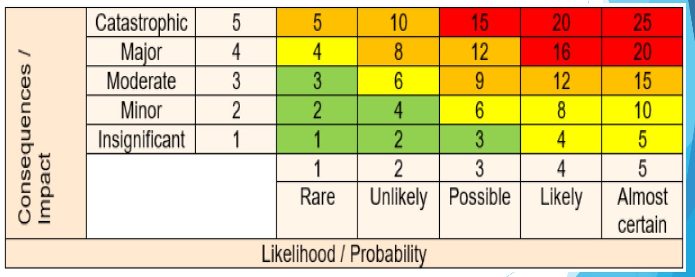
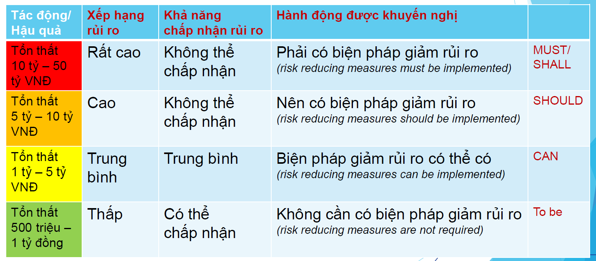
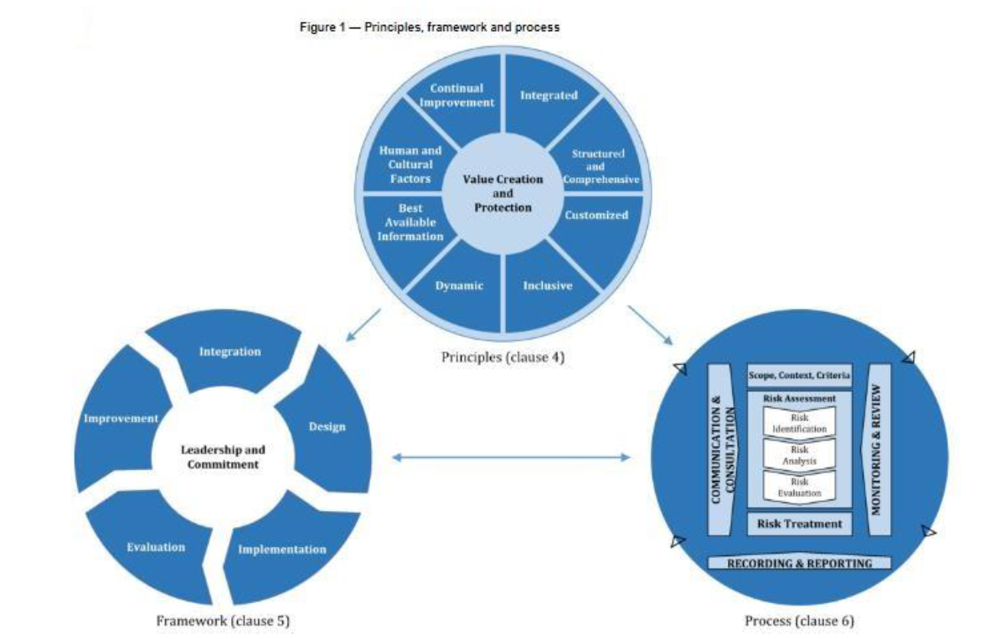

<!-- omit in toc -->

<h1> NT207 - QUẢN LÝ RỦI RO VÀ AN TOÀN THÔNG TIN TRONG DOANH NGHIỆP</h1>

<h1>Mục Lục</h1>

- [Chương 1: Giới thiệu về QLRR - Phạm vi QLRR - Các thuật ngữ và định nghĩa](#chương-1-giới-thiệu-về-qlrr---phạm-vi-qlrr---các-thuật-ngữ-và-định-nghĩa)
  - [**1.1. Giới Thiệu Về QLRR**](#11-giới-thiệu-về-qlrr)
  - [**1.2. Phạm Vi QLRR**](#12-phạm-vi-qlrr)
  - [**1.3. Các thuật ngữ và định nghĩa về Rủi ro (RR) và Quản Lý Rủi ro**](#13-các-thuật-ngữ-và-định-nghĩa-về-rủi-ro-rr-và-quản-lý-rủi-ro)
- [Chương 2: Mối đe dọa , Điểm yếu , Các mục tiêu kiểm soát và kiểm soát Rủi ro ATTT](#chương-2-mối-đe-dọa--điểm-yếu--các-mục-tiêu-kiểm-soát-và-kiểm-soát-rủi-ro-attt)
  - [2.1. Mối đe dọa (Threat)](#21-mối-đe-dọa-threat)
    - [2.1.1. Định nghĩa mối đe dọa (Threat)](#211-định-nghĩa-mối-đe-dọa-threat)
    - [**2.1.2. Sự cố (Incident) trong định nghĩa mối đe dọa**](#212-sự-cố-incident-trong-định-nghĩa-mối-đe-dọa)
    - [**2.1.3. Các ví dụ về mối đe dọa ATTT**](#213-các-ví-dụ-về-mối-đe-dọa-attt)
    - [**2.1.4. Cách nhận biết mối đe dọa đối với ATTT**](#214-cách-nhận-biết-mối-đe-dọa-đối-với-attt)
    - [**2.1.5. Phân biệt mối đe dọa và rủi ro khi phát biểu**](#215-phân-biệt-mối-đe-dọa-và-rủi-ro-khi-phát-biểu)
  - [**2.2. Điểm yếu (Vulnerability)**](#22-điểm-yếu-vulnerability)
    - [**2.2.1. Định nghĩa điểm yếu (Vulnerability)**](#221-định-nghĩa-điểm-yếu-vulnerability)
    - [**2.2.2. Các ví dụ về điểm yếu**](#222-các-ví-dụ-về-điểm-yếu)
    - [**2.2.3. Cách nhận biết điểm yếu đối với ATTT**](#223-cách-nhận-biết-điểm-yếu-đối-với-attt)
    - [**2.2.4. Báo cáo về một mối đe dọa khai thác điểm yếu**](#224-báo-cáo-về-một-mối-đe-dọa-khai-thác-điểm-yếu)
    - [**2.2.5. Phân biệt điểm yếu và rủi ro khi phát biểu**](#225-phân-biệt-điểm-yếu-và-rủi-ro-khi-phát-biểu)
  - [**2.3. Các Mục Tiêu Kiểm Soát Và Kiểm Soát Rủi Ro ATTT**](#23-các-mục-tiêu-kiểm-soát-và-kiểm-soát-rủi-ro-attt)
    - [**2.3.1 Các chính sách ATTT** (Nhóm A.5)](#231-các-chính-sách-attt-nhóm-a5)
    - [**2.3.2 Tổ chức đảm bảo ATTT** (Nhóm A.6)](#232-tổ-chức-đảm-bảo-attt-nhóm-a6)
    - [**2.3.3 An toàn nguồn nhân lực** (Nhóm A.7)](#233-an-toàn-nguồn-nhân-lực-nhóm-a7)
    - [**2.3.4 Quản lý tài sản** (Nhóm A.8)](#234-quản-lý-tài-sản-nhóm-a8)
    - [**2.3.5 Quản lý truy cập** (Nhóm A.9)](#235-quản-lý-truy-cập-nhóm-a9)
    - [**2.3.6 Mật mã học** (Nhóm A.10)](#236-mật-mã-học-nhóm-a10)
    - [**2.3.7 An toàn vật lý và môi trường** (Nhóm A.11)](#237-an-toàn-vật-lý-và-môi-trường-nhóm-a11)
    - [**2.3.8 An toàn vận hành** (Nhóm A.12)](#238-an-toàn-vận-hành-nhóm-a12)
    - [**2.3.9 An toàn truyền thông** (Nhóm A.13)](#239-an-toàn-truyền-thông-nhóm-a13)
    - [**2.3.10 Tiếp nhận, phát triển và duy trì hệ thống** (Nhóm A.14)](#2310-tiếp-nhận-phát-triển-và-duy-trì-hệ-thống-nhóm-a14)
    - [**2.3.11 Quan hệ với nhà cung cấp** (Nhóm A.15)](#2311-quan-hệ-với-nhà-cung-cấp-nhóm-a15)
    - [**2.3.12 Quản lý sự cố ATTT** (Nhóm A.16)](#2312-quản-lý-sự-cố-attt-nhóm-a16)
    - [**2.3.13 ATTT trong quản lý liên tục hoạt động** (Nhóm A.17)](#2313-attt-trong-quản-lý-liên-tục-hoạt-động-nhóm-a17)
    - [**2.3.14 Sự tuân thủ** (Nhóm A.18)](#2314-sự-tuân-thủ-nhóm-a18)
- [Chương 3: Các nguyên tắc quản lý rủi ro (Principles)](#chương-3-các-nguyên-tắc-quản-lý-rủi-ro-principles)
  - [**3.1. Mục đích quản lý rủi ro (QLRR)**](#31-mục-đích-quản-lý-rủi-ro-qlrr)
  - [**3.2. Các nguyên tắc quản lý rủi ro (QLRR)**](#32-các-nguyên-tắc-quản-lý-rủi-ro-qlrr)
- [Chương 4: Khuôn khổ quản lý rủi ro (Framework)](#chương-4-khuôn-khổ-quản-lý-rủi-ro-framework)
  - [**4.1. Khái quát (General)**](#41-khái-quát-general)
  - [**4.2. Sự lãnh đạo và cam kết (Leadership and commitment)**](#42-sự-lãnh-đạo-và-cam-kết-leadership-and-commitment)
  - [**4.3. Tích hợp (Integration)**](#43-tích-hợp-integration)
  - [**4.4. Thiết kế (Design)**](#44-thiết-kế-design)
  - [**4.5. Thực thi - Áp dụng (Implementation)**](#45-thực-thi---áp-dụng-implementation)
  - [**4.6. Xem xét và đánh giá (Evaluation)**](#46-xem-xét-và-đánh-giá-evaluation)
  - [**4.7. Cải tiến (Improvement)**](#47-cải-tiến-improvement)
- [Chương 5: Quy trình quản lý rủi ro (Process)](#chương-5-quy-trình-quản-lý-rủi-ro-process)
  - [5.1. Khái quát (General)](#51-khái-quát-general)
  - [**5.2. Trao đổi thông tin và tham vấn (Establishing communication and consultation)**](#52-trao-đổi-thông-tin-và-tham-vấn-establishing-communication-and-consultation)
  - [**5.3. Phạm vi, bối cảnh và tiêu chí (Scope, context and criteria)**](#53-phạm-vi-bối-cảnh-và-tiêu-chí-scope-context-and-criteria)
  - [**5.4. Đánh giá rủi ro (Risk Assessment)**](#54-đánh-giá-rủi-ro-risk-assessment)
  - [**5.5. Xử lý rủi ro (Risk Treatment)**](#55-xử-lý-rủi-ro-risk-treatment)
  - [**5.6. Theo dõi và Xem xét (Monitoring and review)**](#56-theo-dõi-và-xem-xét-monitoring-and-review)
  - [**5.7. Cải tiến, lập hồ sơ và báo cáo (Improving, Recording and Reporting)**](#57-cải-tiến-lập-hồ-sơ-và-báo-cáo-improving-recording-and-reporting)
- [**Chương 6: Chiến lược quản lý rủi ro (RM-Strategy)**](#chương-6-chiến-lược-quản-lý-rủi-ro-rm-strategy)
  - [**6.1. Khái quát (General)**](#61-khái-quát-general)
  - [**6.2. Các định nghĩa chiến lược**](#62-các-định-nghĩa-chiến-lược)
  - [**6.3. Chiến lược QLRR ATTT (Risk Management Strategy)**](#63-chiến-lược-qlrr-attt-risk-management-strategy)
- [Chương 7. Triển khai phương pháp FMEA/FMECA cho QLRR](#chương-7-triển-khai-phương-pháp-fmeafmeca-cho-qlrr)
  - [**7.1. Khái quát (General)**](#71-khái-quát-general)
  - [**7.2. Các định nghĩa về FMEA**](#72-các-định-nghĩa-về-fmea)
  - [**7.3. Các định nghĩa về FMECA**](#73-các-định-nghĩa-về-fmeca)
  - [**7.4. Triển khai phương pháp FMEA và FMECA**](#74-triển-khai-phương-pháp-fmea-và-fmeca)
  - [**7.5. Kế hoạch hành động (Action Plan)**](#75-kế-hoạch-hành-động-action-plan)
- [Chương 8: Kế hoạch kinh doanh liên tục](#chương-8-kế-hoạch-kinh-doanh-liên-tục)
  - [**8.1. Khái quát (General)**](#81-khái-quát-general)
  - [**8.2. Vai trò của kế hoạch hoạt động liên tục (Roles of the BCP)**](#82-vai-trò-của-kế-hoạch-hoạt-động-liên-tục-roles-of-the-bcp)
  - [**8.3. Yêu cầu về lập kế hoạch kinh doanh liên tục**](#83-yêu-cầu-về-lập-kế-hoạch-kinh-doanh-liên-tục)
  - [**8.4. Quy trình lập kế hoạch kinh doanh liên tục (Implementation by a Process of BCP)**](#84-quy-trình-lập-kế-hoạch-kinh-doanh-liên-tục-implementation-by-a-process-of-bcp)
- [Chương 9 Chỉ Số Rủi Ro Trọng Yếu (Key Risk Indicator)](#chương-9-chỉ-số-rủi-ro-trọng-yếu-key-risk-indicator)
  - [**9.1. Khái quát (General)**](#91-khái-quát-general)
  - [**9.2. Phân biệt KPI và KRI**](#92-phân-biệt-kpi-và-kri)
  - [**9.3. Cách thiết lập và phát triển KRI**](#93-cách-thiết-lập-và-phát-triển-kri)
  - [**9.4. Các chỉ số rủi ro trọng yếu (KRI) tiêu biểu**](#94-các-chỉ-số-rủi-ro-trọng-yếu-kri-tiêu-biểu)

# Chương 1: Giới thiệu về QLRR - Phạm vi QLRR - Các thuật ngữ và định nghĩa
## **1.1. Giới Thiệu Về QLRR**
*   **Rủi ro và tầm quan trọng của quản lý rủi ro đối với doanh nghiệp**:
    *   **Rủi ro là tác động của sự không chắc chắn lên mục tiêu** theo ISO 31000:2018. Tác động này có thể tích cực, tiêu cực hoặc cả hai. Sự không chắc chắn là trạng thái thiếu hụt thông tin liên quan đến một sự kiện, hậu quả hoặc khả năng xảy ra.
    *   Trong bối cảnh hệ thống quản lý ATTT, **rủi ro ATTT là tác động của sự không chắc chắn lên các mục tiêu ATTT**.
    *   **Rủi ro ATTT** liên quan đến khả năng các mối đe dọa khai thác điểm yếu của tài sản thông tin gây tổn hại cho tổ chức (vật chất, danh tiếng, uy tín).
    *   **Rủi ro kết hợp ba yếu tố**: sự kiện tiềm ẩn, xác suất xảy ra và mức độ nghiêm trọng tiềm ẩn. Ví dụ về sự cố CrowdStrike được đưa ra để minh họa các yếu tố này.
    *   **Tầm quan trọng của QLRR đối với doanh nghiệp** bao gồm: tạo môi trường an toàn, tăng tính ổn định, bảo vệ khỏi sự kiện có hại, bảo vệ người liên quan và tài sản, tiết kiệm phí bảo hiểm.
*   **Tầm quan trọng của QLRR ATTT trong doanh nghiệp**:
    *   Giúp phát hiện sớm tổn hại tài sản.
    *   Giảm thiểu hoặc hạn chế tối đa tổn thất.
    *   Chủ động phản ứng với mối đe dọa.
    *   Ưu tiên nguồn lực ứng phó rủi ro ảnh hưởng đến mục tiêu.
    *   Tuân thủ pháp luật và quy định.
    *   Tăng khả năng thành công của dự án CNTT.
    *   Cải thiện hiệu suất, nâng cao niềm tin.
    *   Xây dựng văn hóa và nâng cao nhận thức rủi ro.
    *   Giảm sự lệ thuộc vào chuyên gia.
    *   Kiểm soát sự cố, đảm bảo hoạt động kinh doanh liên tục.
    *   Cải thiện chất lượng ra quyết định của cấp quản trị.
    *   Nâng cao hiệu quả đáp ứng tích cực của cấp quản trị với đề xuất cấp dưới.
    *   Rủi ro liên quan đến CNTT bao gồm: rủi ro từ dịch vụ CNTT, rủi ro khi triển khai dự án CNTT, và rủi ro ATTT ảnh hưởng đến tính bảo mật, toàn vẹn và sẵn có (A-I-C).
*   **Tính hai mặt và thuộc tính của rủi ro**:
    *   **Tính hai mặt**: Rủi ro có cả mặt tốt và mặt xấu, tích cực và tiêu cực. Tuy nhiên, các tiêu chuẩn ISO 27001:2013 và các tài liệu liên quan về ATTT xem xét rủi ro ATTT hoàn toàn theo khía cạnh tiêu cực.
    *   **Thuộc tính**: Rủi ro có thể mô tả định tính hoặc định lượng.

## **1.2. Phạm Vi QLRR**

*   **Phạm vi quản lý rủi ro an toàn thông tin (QLRR ATTT)**:
    *   Tài liệu này cung cấp hướng dẫn về quản lý rủi ro ATTT trong doanh nghiệp theo **ISO 31000:2018** kết hợp với **ISO 27000:2018, ISO 27001:2013, ISO 27002:2013, ISO 27005:2008 và ISO 22301:2019**.
    *   Việc áp dụng các hướng dẫn này có thể điều chỉnh cho phù hợp với mọi tổ chức.
    *   Tiêu chuẩn **ISO 31000:2018** cung cấp phương pháp tiếp cận chung để quản lý mọi loại hình rủi ro, không đặc thù cho ngành nào.
    *   **ISO** là Tổ chức Tiêu chuẩn hoá quốc tế (International Organization for Standardization). Việt Nam là thành viên chính thức từ năm 1977.
*   **Các định nghĩa về an toàn thông tin theo ISO 27000:2018**:
    *   **An toàn thông tin (ATTT)** (bảo mật thông tin) là bảo toàn **tính bí mật, tính toàn vẹn và tính sẵn có** của thông tin.
    *   **Tính sẵn có (Availability)** là đặc tính có thể truy cập và sử dụng được theo yêu cầu của một thực thể được ủy quyền. Các thuật ngữ liên quan bao gồm redundancy, failover, RAID, data recovery, business continuity plan.
    *   **Tính toàn vẹn (Integrity)** là đặc tính của tính chính xác và đầy đủ, thông tin không bị chỉnh sửa mà không bị phát hiện. Các thuật ngữ liên quan bao gồm version control, access control, security control, data logs, checksums, backup and recovery.
    *   **Tính bảo mật (Confidentiality)** là đặc tính mà thông tin không được cung cấp hoặc tiết lộ cho các cá nhân, tổ chức hoặc quy trình trái phép. Các thuật ngữ liên quan bao gồm Encryption, Authentication (2FA), access control lists, file permissions.
    *   Ba đặc tính này (A-I-C) còn được gọi là **3 trụ cột/thành phần/khái niệm/nguyên tắc của an toàn thông tin**.

## **1.3. Các thuật ngữ và định nghĩa về Rủi ro (RR) và Quản Lý Rủi ro**

*   **Risk (Rủi ro)**:
    *   Là **tác động/ảnh hưởng của sự không chắc chắn lên mục tiêu** (ISO 31000:2018).
    *   Tác động có thể tích cực, tiêu cực hoặc cả hai.
    *   Sự không chắc chắn là trạng thái thiếu hụt thông tin về sự kiện, hậu quả hoặc khả năng xảy ra.
    *   Thường được thể hiện dưới dạng nguồn rủi ro, sự kiện tiềm ẩn, hậu quả và khả năng xảy ra.
    *   Trong bối cảnh ATTT, là tác động của sự không chắc chắn đối với mục tiêu ATTT.
    *   Liên quan đến khả năng tiềm ẩn của mối đe dọa khai thác điểm yếu của tài sản thông tin gây tác động cho tổ chức.
    *   Sự cố ("incident") là rủi ro đã xảy ra.
*   **Risk management (Quản lý rủi ro)**: Là phối hợp các hoạt động để chỉ đạo và kiểm soát một tổ chức về rủi ro [ISO 31000:2018].
*   **Stakeholder (Bên liên quan)**: Là người hoặc tổ chức có thể ảnh hưởng, bị ảnh hưởng, hoặc tự nhận thức là bị ảnh hưởng bởi một quyết định hay hoạt động [ISO 31000:2018].
*   **Risk Source (Nguồn rủi ro)**: Là yếu tố mà tự thân nó hoặc trong sự kết hợp có thể làm phát sinh rủi ro [ISO 31000:2018].
*   **Event (Sự kiện)**: Sự xảy ra (sự xuất hiện) hoặc thay đổi của một tập hợp các tình huống cụ thể [ISO 31000:2018]. Có thể xảy ra một hoặc nhiều lần, có nhiều nguyên nhân và hệ quả. Cũng có thể là điều mong đợi không xảy ra hoặc điều không mong đợi lại xảy ra. Một sự kiện có thể là một nguồn rủi ro. Đôi khi được gọi là "incident" hoặc "accident".
*   **Consequence (Hệ quả)**: Kết quả của một sự kiện ảnh hưởng đến mục tiêu [ISO 31000:2018].
*   **Likelihood (Khả năng xảy ra)**: Cơ hội một điều gì đó xảy ra [ISO 31000:2018].
*   **Control (Kiểm soát)**: Biện pháp duy trì và/hoặc thay đổi các rủi ro [ISO 31000:2018].
*   **Risk Appetite (Khẩu vị rủi ro)**: Lượng và loại rủi ro mà một tổ chức sẵn sàng chấp nhận để đạt được các mục tiêu chiến lược.
*   **Risk Tolerance (Khả năng chịu đựng rủi ro)**: Mức độ rủi ro mà một thực thể sẵn sàng chấp nhận để đạt được kết quả mong muốn tiềm năng. Còn gọi là "Biên độ rủi ro" hay "Độ giãn rủi ro cho phép". Tổng của Khẩu vị rủi ro và Biên độ rủi ro không được vượt quá Giới hạn rủi ro.
*   **Risk Attitude (Thái độ rủi ro)**: Phản ứng được lựa chọn đối với sự không chắc chắn có ý nghĩa, chịu ảnh hưởng của nhận thức. Đề cập đến sự sẵn lòng và sở thích của các bên liên quan đối với rủi ro. Các thái độ rủi ro bao gồm:
    *   **Risk-averse**: không thích rủi ro.
    *   **Risk-seeker**: chấp nhận rủi ro như cơ hội.
    *   **Risk-neutral**: trung lập với rủi ro, đối phó khách quan.
    *   **Risk-tolerant**: không chú ý đến rủi ro cho đến khi thành vấn đề.
*   **Residual Risk (Rủi ro còn lại)**: Rủi ro còn lại sau khi xử lý rủi ro [ISO 27000:2018]. Có thể bao gồm rủi ro chưa được nhận diện và còn được gọi là "retained risk". Ví dụ về việc sử dụng UPS không triệt tiêu hoàn toàn rủi ro liên quan đến nguồn điện.
*   **Risk Criteria (Tiêu chí rủi ro)**: Điều khoản tham chiếu để đánh giá mức độ (cao/thấp), tầm quan trọng của rủi ro [ISO 27000:2018]. Dựa trên mục tiêu tổ chức, bối cảnh bên ngoài và bên trong. Có thể đượcDerived from standards, laws, policies và các yêu cầu khác. Thể hiện quan điểm về mức độ rủi ro có thể chấp nhận/chịu đựng được. Giúp doanh nghiệp thể hiện khả năng chấp nhận rủi ro trong quá trình ra quyết định (rủi ro chấp nhận được, không chấp nhận được, cần giảm xuống mức thấp nhất có thể). Mức độ rủi ro chấp nhận được dựa trên đánh giá khả năng xảy ra, hậu quả, hiệu quả kiểm soát và xếp hạng rủi ro. Ví dụ về xếp hạng rủi ro theo mức độ Thấp, Trung bình, Cao dựa trên khả năng xảy ra và hậu quả.
*   **Risk matrix (Ma trận rủi ro)**: Trình bày xếp hạng rủi ro, khả năng xảy ra và hậu quả theo dạng ma trận. Thể hiện mức độ chấp nhận rủi ro và hành động được khuyến nghị tương ứng với từng mức rủi ro (Rất cao - Không thể chấp nhận - Phải giảm thiểu; Cao - Không thể chấp nhận - Nên giảm thiểu; Trung bình - Trung bình - Có thể giảm thiểu; Thấp - Có thể chấp nhận - Không cần giảm thiểu). Ví dụ về ma trận rủi ro dựa trên tổn thất tài chính.
    
    
    
*   **Risk Assessment - Risk Evaluation (Đánh giá rủi ro - Đánh giá rủi ro)**:
    *   **Risk Assessment** là quá trình tổng thể gồm nhận diện rủi ro, phân tích rủi ro và đánh giá rủi ro.
    *   **Risk Evaluation** là quá trình so sánh kết quả phân tích rủi ro với tiêu chí rủi ro để xác định mức độ chấp nhận được của rủi ro. Hỗ trợ quyết định về xử lý rủi ro.
*   **Performance (Kết quả đo lường được)**: Kết quả có thể đo lường được [ISO 27000:2018]. Có thể liên quan đến định lượng hoặc định tính, quản lý hoạt động, quy trình, sản phẩm, hệ thống hoặc tổ chức.
*   **Policy (Chính sách)**: Ý định và chỉ đạo của một tổ chức, được thể hiện chính thức bởi ban quản lý cấp cao [ISO 27000:2018]. Hoặc một tuyên bố về mục tiêu, quy tắc, thông lệ hoặc quy định chi phối các hoạt động trong một bối cảnh nhất định.
*   **Process (Quá trình / quy trình)**: Một chuỗi các hoạt động sử dụng đầu vào để mang lại kết quả mong muốn [ISO 9001:2015]. Ví dụ: quy trình mua sắm, đấu thầu.
*   **Procedure (Thủ tục)**: Một cách thức xác định để thực hiện một hoạt động hoặc một quy trình. Có thể được văn bản hóa hoặc không [ISO 9001:2015]. Thường là một chuỗi hành động cố định hoặc có thứ tự dẫn đến một kết quả.
*   **Các động từ cần chú ý khi đọc tài liệu ISO**:
    *   **"shall"** chỉ yêu cầu bắt buộc.
    *   **"should"** chỉ khuyến nghị.
    *   **"may"** chỉ sự cho phép.
    *   **"can"** chỉ khả năng hoặc năng lực.

# Chương 2: Mối đe dọa , Điểm yếu , Các mục tiêu kiểm soát và kiểm soát Rủi ro ATTT
## 2.1. Mối đe dọa (Threat)

### 2.1.1. Định nghĩa mối đe dọa (Threat)

* Mối đe dọa là nguyên nhân tiềm ẩn của sự cố không mong muốn, có thể dẫn đến tổn hại cho hệ thống hoặc doanh nghiệp (theo ISO 27000:2018). 
* Nguyên nhân tiềm ẩn này có thể là một hành động, một sự kiện, hoặc một tình huống độc hại có thể khai thác điểm yếu.
*   **Rủi ro** được định nghĩa là sự kết hợp của một sự kiện tiềm ẩn, xác suất xảy ra sự kiện, và mức độ nghiêm trọng của hậu quả. Theo ISO 31000:2018 và ISO 27000:2018, rủi ro là tác động/hiệu ứng của sự không chắc chắn lên các mục tiêu.
*   **Rủi ro ATTT** liên quan đến khả năng các mối đe dọa khai thác được điểm yếu của tài sản thông tin và gây tổn hại cho tổ chức. Rủi ro ATTT được đo lường bằng sự kết hợp giữa khả năng xảy ra và hậu quả của sự kiện.
* **Sự cố (Incident)** là những rủi ro đã hiện hữu, là một sự kiện không được lên kế hoạch. Sự cố ATTT là một hoặc một loạt các sự kiện ATTT không mong muốn hoặc bất ngờ có khả năng gây tổn hại đáng kể.

### **2.1.2. Sự cố (Incident) trong định nghĩa mối đe dọa**
*   Sự cố là những rủi ro đã thực sự xảy ra.
*   Một sự cố là một sự kiện không được lên kế hoạch.
*   Sự cố ATTT là các sự kiện ATTT không mong muốn hoặc bất ngờ có khả năng gây tổn hại đến hoạt động của tổ chức và đe dọa ATTT.
*   Mối đe dọa là bất kỳ sự cố nào có thể ảnh hưởng tiêu cực đến tính bảo mật, tính toàn vẹn hoặc tính khả dụng của tài sản.

### **2.1.3. Các ví dụ về mối đe dọa ATTT**
*   Trí tuệ nhân tạo (AI)
*   Mối đe dọa nội bộ (Insider threats)
*   Quyền truy cập đặc quyền bị lạm dụng
*   Virus máy tính, sâu máy tính
*   Botnets, Drive-by attacks, Ransomware, Exploit kits, Rootkits, Man-in-the-middle, SQL Injection, Cross-site scripting, Malware
*   Malvertising, Phishing attacks, Spear phishing, Malicious spam
*   Distributed denial-of-service (DoS/DDoS) attacks
*   Advanced persistent threat attacks, Social Engineering attack
*   Compromised web applications and web pages

### **2.1.4. Cách nhận biết mối đe dọa đối với ATTT**
*   Nhận thức qua giáo dục (hướng dẫn, đào tạo, huấn luyện).
*   Tài liệu Mô hình hóa mối đe dọa của doanh nghiệp.
*   Lập danh sách tài sản CNTT và xác định tài sản cần bảo vệ.
*   Căn cứ vào Phụ lục A của tiêu chuẩn ISO 27001:2013, ISO 27002:2013, TCVN ISO 27001:2019.
*   Bản tin của Cục ATTT (Bộ Thông tin và Truyền thông).
*   Ý kiến của nhà phát triển ứng dụng và các bên liên quan.
*   Sử dụng phần mềm chống virus, nhật ký (log), hệ thống giám sát tự động.
*   Phân loại mối đe dọa theo nguồn gốc: từ bên ngoài, từ bên trong, có cấu trúc, phi cấu trúc.
*   Sử dụng khuôn khổ phân loại mối đe dọa (STRIDE, PESTLE, OCTAVE).
*   Các kịch bản mô tả cách mối đe dọa có thể khai thác lỗ hổng bảo mật.

### **2.1.5. Phân biệt mối đe dọa và rủi ro khi phát biểu**
*   Mối đe dọa phải **cụ thể**, nhìn thấy và có bằng chứng về sự hiện diện.
*   Mối đe dọa không có sự kết hợp khả năng xảy ra và mức độ nghiêm trọng như rủi ro.
*   Rủi ro thường là dự đoán, tiềm ẩn, không hiện diện rõ ràng như mối đe dọa.
*   Rủi ro là sự kết hợp của sự kiện tiềm ẩn, khả năng xảy ra và mức độ nghiêm trọng.
*   Phát biểu về rủi ro thường có các cụm từ như **‘có thể’**, **‘nhiều khả năng xảy ra’**.

## **2.2. Điểm yếu (Vulnerability)**

### **2.2.1. Định nghĩa điểm yếu (Vulnerability)**
*   Điểm yếu là điểm yếu của một tài sản hoặc quyền kiểm soát có thể bị khai thác bởi một hoặc nhiều mối đe dọa (theo ISO 27000:2018).
*   Các thuật ngữ khác như “Security hole / Flaw / Error / Bug …” cũng có hàm ý tương tự.
*   Điểm yếu là những đặc điểm chưa tốt, còn thiếu sót, chưa khắc phục được của con người/hệ thống/ứng dụng CNTT (phần cứng, phần mềm).
*   Điểm yếu của con người liên quan đến kiến thức, chuyên môn, kinh nghiệm, kỹ năng, tính cách, hành vi.
*   Điểm yếu của hệ thống/ứng dụng CNTT thường xuất hiện trong kiến trúc, cấu tạo vật liệu, độ bền, khả năng chịu đựng, năng lực xử lý đồng thời yếu kém.
*   Điểm yếu thường được diễn đạt kèm theo các cụm từ như ‘không có’, ‘thiếu’, ‘yếu’, ‘kém’, ‘lỗ hổng’, ‘chưa đạt yêu cầu’, ‘sai’, ‘cũ/lạc hậu’.
### **2.2.2. Các ví dụ về điểm yếu**
*   Thiếu chính sách/quy định về ATTT.
*   Xác thực ứng dụng chỉ bằng mật khẩu (Single-Factor Authentication).
*   Sử dụng mật khẩu yếu.
*   Sử dụng giao thức bảo mật kém (Telnet, HPPT).
*   Phần mềm không còn được hỗ trợ.
*   Cấu hình thiết bị mạng không theo chuẩn bảo mật.
*   Không có thiết bị dự phòng cho ứng dụng quan trọng.
*   Không có nguồn điện dự phòng.
*   Không có hoạt động huấn luyện nâng cao nhận thức ATTT.
*   Các cổng mở trên tài sản "public-facing" bị bỏ quên.
*   Hệ điều hành không được hỗ trợ hoặc không được vá lỗi định kỳ (Windows 7).
*   Danh sách tài sản CNTT không được cập nhật.
*   Người phụ trách ATTT không biết tài sản quan trọng nhất.
*   Không có hồ sơ theo dõi cập nhật, vá lỗi phần mềm.
*   Thông tin xác thực người dùng IAM không được sử dụng trong thời gian dài; vai trò IAM không còn sử dụng.
*   Không áp dụng xác thực đa yếu tố (MFA) cho quản trị viên.
*   Dữ liệu DNS không được mã hóa, không được xác thực.
*   Không có chính sách bảo vệ quyền riêng tư dữ liệu.
*   Không xác thực nguồn gốc hoặc tính toàn vẹn của dữ liệu DNS.
*   Mật khẩu mặc định của thiết bị không được thay đổi.
*   Không được kiểm tra ATTT định kỳ bởi tổ chức độc lập.
*   Thiếu văn bản quy định về quản lý mã nguồn, quản lý sự thay đổi, quản lý thiết bị di động.
*   Không có môi trường kiểm thử phần mềm.
*   Không có thỏa thuận bảo mật thông tin với người dùng quan trọng.
*   Sử dụng bộ định tuyến cũ kết nối với mạng thanh toán SWIFT.
*   Giao thức SNMP sử dụng hàm băm yếu và thuật toán DES.
*   Hồ sơ thiếu sót (sơ đồ mạng, danh sách người dùng, danh sách IP).
*   Sản phẩm chưa được nghiệm thu ATTT.

### **2.2.3. Cách nhận biết điểm yếu đối với ATTT**
*   Tham khảo tài liệu (danh sách các điểm yếu phổ biến).
*   Lập danh sách tài sản và xác định điểm yếu của tài sản.
*   Điểm yếu còn gọi là lỗ hổng bảo mật.
*   Căn cứ vào Phụ lục A – ISO 27001:2013, ISO 27002:2013, TCVN ISO 27001:2019 (nếu thiếu biện pháp kiểm soát phù hợp tại Nhóm Yêu cầu).
*   Danh sách các lỗ hổng bảo mật thông tin được tiết lộ công khai (‘Common Vulnerabilities and Exposures (CVE)’). Ví dụ về cảnh báo lỗ hổng Cisco từ Cục ATTT dựa trên CVE.
*   Căn cứ vào tài liệu kỹ thuật hoặc thông báo của nhà sản xuất ứng dụng CNTT.
*   Sử dụng Quy trình quản lý điểm yếu hệ thống CNTT.
*   Sử dụng công cụ như Penetration testing, vulnerability scanners, security audits.
*   Bản tin của Cục ATTT cảnh báo về các điểm yếu, lỗ hổng bảo mật.

### **2.2.4. Báo cáo về một mối đe dọa khai thác điểm yếu**
*   Ví dụ về báo cáo của Bộ Tài Chính Mỹ về mối đe dọa từ hacker khai thác lỗi zero-day trên thiết bị tường lửa Sophos.
*   Mối đe dọa là hành động của kẻ tấn công khai thác lỗi zero-day.
*   Điểm yếu là lỗi zero-day của thiết bị tường lửa Sophos.

### **2.2.5. Phân biệt điểm yếu và rủi ro khi phát biểu**
*   Điểm yếu phải luôn cụ thể, nhìn thấy và có bằng chứng về sự hiện diện.
*   Điểm yếu không có sự kết hợp khả năng xảy ra và mức độ nghiêm trọng như rủi ro.
*   Rủi ro thường là dự đoán, tiềm ẩn, không hiện diện rõ ràng như điểm yếu.
*   Rủi ro là sự kết hợp của sự kiện tiềm ẩn, khả năng xảy ra và mức độ nghiêm trọng.
*   Phát biểu về rủi ro thường có các cụm từ như ‘có thể’, ‘nhiều khả năng xảy ra’.

## **2.3. Các Mục Tiêu Kiểm Soát Và Kiểm Soát Rủi Ro ATTT**

Nội dung bao gồm các nhóm mục tiêu kiểm soát ATTT dựa trên Phụ lục A của tiêu chuẩn ISO 27001, được minh họa thông qua các điểm yếu, mối đe dọa và rủi ro được phát hiện trong một cuộc kiểm toán ATTT tại Ngân hàng TMCP XYZ:

### **2.3.1 Các chính sách ATTT** (Nhóm A.5)
*   **Điểm yếu:** Chưa có chính sách ATTT được phê duyệt, công bố và thông báo.
*   **Mối đe dọa:** Mối đe dọa nội bộ (nhân viên không biết về chính sách), mối đe dọa bên ngoài (vi phạm pháp luật).
*   **Rủi ro:** Nhân viên không tuân thủ thực hành ATTT tốt nhất, doanh nghiệp bị phạt.
### **2.3.2 Tổ chức đảm bảo ATTT** (Nhóm A.6)
*   **Tổ chức nội bộ:**
    *   **Điểm yếu:** Bảng mô tả công việc không quy định rõ nhiệm vụ khi có sự cố ATTT.
    *   **Mối đe dọa:** Nhân viên chỉ làm theo mô tả công việc, sự lơ là của bộ phận ATTT.
    *   **Rủi ro:** Kẻ tấn công xâm nhập, nhân viên không biết cách ứng phó, tổn thất tài sản.
*   **Các thiết bị di động và làm việc từ xa:**
    *   **Điểm yếu:** Không có chính sách ATTT cho thiết bị di động.
    *   **Mối đe dọa:** Nhân viên truy cập mạng và xử lý dữ liệu tùy tiện trên thiết bị cá nhân.
    *   **Rủi ro:** Mất thiết bị, sao chép dữ liệu không an toàn, kẻ xấu chiếm đoạt dữ liệu qua mạng công cộng.

### **2.3.3 An toàn nguồn nhân lực** (Nhóm A.7)
*   **Điểm yếu:** Người lao động không được đào tạo nâng cao nhận thức về ATTT.
*   **Mối đe dọa:** Người lao động làm việc tùy tiện, không theo quy trình, hoặc sắp nghỉ việc không quan tâm đến ATTT.
*   **Rủi ro:** Người lao động gây ra lỗi, lấy cắp thông tin nhạy cảm.

### **2.3.4 Quản lý tài sản** (Nhóm A.8)
*   **Điểm yếu:** Không có quy định bàn giao tài sản khi nghỉ việc, không có quy định phân loại thông tin theo mức độ bí mật.
*   **Mối đe dọa:** Người sử dụng lạm quyền, vi phạm bảo mật thông tin.
*   **Rủi ro:** Mất tài sản khi nhân viên nghỉ việc, lộ thông tin nhạy cảm.

### **2.3.5 Quản lý truy cập** (Nhóm A.9)
*   **Điểm yếu:** Không có chính sách, quy trình kiểm soát truy cập, không có hệ thống quản lý mật khẩu.
*   **Mối đe dọa:** Lạm dụng quyền truy cập, trộm cắp thông tin, bị chiếm đoạt mật khẩu.
*   **Rủi ro:** Cấp sai quyền truy cập, mất ATTT do mật khẩu bị chiếm đoạt.

### **2.3.6 Mật mã học** (Nhóm A.10)
*   **Điểm yếu:** Có sử dụng mật mã nhưng chưa có chính sách sử dụng để bảo vệ tính bảo mật, toàn vẹn và xác thực của thông tin.
*   **Mối đe dọa:** Hành động vi phạm biện pháp bảo vệ bằng mật mã.
*   **Rủi ro:** Thuật toán mã hóa, khóa hoặc thông tin nhạy cảm bị đánh cắp.

### **2.3.7 An toàn vật lý và môi trường** (Nhóm A.11)
*   **Điểm yếu:** Chưa có biện pháp kiểm soát ra vào phòng máy chủ, không đặt cable mạng vào ống bảo vệ, bố trí phòng máy chủ ở nơi dễ ngập nước.
*   **Mối đe dọa:** Người không phận sự ra vào, ánh nắng trực tiếp vào cable, lũ lụt vào phòng máy chủ.
*   **Rủi ro:** Thiết bị gặp sự cố, mất tín hiệu, chập mạch điện, hỏng thiết bị do nước.

### **2.3.8 An toàn vận hành** (Nhóm A.12)
*   **Điểm yếu:** Không có quy định sao chép dữ liệu dự phòng, chưa phân tách môi trường phát triển, kiểm thử và vận hành, không cài đặt phần mềm chống virus.
*   **Mối đe dọa:** Sao chép dự phòng thiếu, sử dụng nhầm dữ liệu kiểm thử, tấn công của mã độc.
*   **Rủi ro:** Không thể phục hồi dữ liệu, dữ liệu thực bị thay đổi, máy tính ngừng hoạt động do nhiễm mã độc.

### **2.3.9 An toàn truyền thông** (Nhóm A.13)
*   **Điểm yếu:** Dữ liệu trao đổi bên ngoài chưa được mã hóa, chưa sử dụng phần mềm giám sát mạng, dùng giao thức Telnet.
*   **Mối đe dọa:** Vi phạm bảo mật truyền dữ liệu, truy cập mạng trái phép, dữ liệu Telnet không an toàn.
*   **Rủi ro:** Kẻ tấn công đọc được dữ liệu, mạng bị chậm, tấn công "man-in-the-middle".

### **2.3.10 Tiếp nhận, phát triển và duy trì hệ thống** (Nhóm A.14)
*   **Điểm yếu:** Chưa có thủ tục kiểm soát sự thay đổi hệ thống.
*   **Mối đe dọa:** Thay đổi hệ thống thất bại ngoài dự tính.
*   **Rủi ro:** Hệ thống không vận hành bình thường sau thay đổi, gián đoạn cung cấp dịch vụ.

### **2.3.11 Quan hệ với nhà cung cấp** (Nhóm A.15)
*   **Điểm yếu:** Hợp đồng với nhà cung cấp không có thỏa thuận bảo mật thông tin (NDA).
*   **Mối đe dọa:** Lạm dụng quyền hạn được cấp cho nhà cung cấp.
*   **Rủi ro:** Nhà cung cấp trộm cắp và tiết lộ thông tin.

### **2.3.12 Quản lý sự cố ATTT** (Nhóm A.16)
*   **Điểm yếu:** Chưa có thủ tục hoặc kịch bản ứng phó sự cố ATTT, chưa có quy trình thu thập và bảo quản bằng chứng.
*   **Mối đe dọa:** Kẻ tấn công có chủ đích, thu thập bằng chứng không phù hợp.
*   **Rủi ro:** Nhân viên không biết cách xử lý sự cố, không thu thập đủ bằng chứng, gián đoạn hoạt động kéo dài.

### **2.3.13 ATTT trong quản lý liên tục hoạt động** (Nhóm A.17)
*   **Điểm yếu:** Không có thiết bị mạng dự phòng.
*   **Mối đe dọa:** Vòng đời thiết bị kết thúc sớm, vi phạm bảo trì.
*   **Rủi ro:** Thiết bị mạng duy nhất bị hỏng, gián đoạn vận hành.

### **2.3.14 Sự tuân thủ** (Nhóm A.18)
*   **Điểm yếu:** Sử dụng phần mềm không có bản quyền, chưa thực hiện soát xét ATTT định kỳ.
*   **Mối đe dọa:** Vi phạm luật sở hữu trí tuệ, vi phạm yêu cầu rà soát ATTT.
*   **Rủi ro:** Bị kiện, bị phạt, phần mềm không được cập nhật.

# Chương 3: Các nguyên tắc quản lý rủi ro (Principles)
## **3.1. Mục đích quản lý rủi ro (QLRR)**

*   **Giá Trị - Tạo ra Giá Trị**
    *   Quá trình QLRR tập trung vào việc xác định những yếu tố thực sự tạo ra giá trị cho sản phẩm hoặc dịch vụ và loại bỏ những yếu tố không cần thiết.
    *   Nền tảng của mọi doanh nghiệp thành công nằm ở việc mang lại giá trị vượt trội.
    *   Mục đích của quản lý rủi ro là **tạo ra và bảo vệ giá trị**.
    *   QLRR giúp **cải thiện hiệu suất, khuyến khích sự đổi mới và hỗ trợ việc đạt được các mục tiêu**.
    *   **Ví dụ:** Nhà sản xuất PC và Laptop quản lý rủi ro bằng cách cung cấp bảo hành 2 năm và dự trữ phụ tùng, nhằm tạo ra giá trị bảo hành và giúp khách hàng yên tâm mua hàng. "2 năm bảo hành" thúc đẩy hiệu suất, đổi mới và đạt mục tiêu.

*   **Phân biệt mục đích và mục tiêu**
    *   **Mục đích (Purpose)** cung cấp lý do để thực hiện một hành động và chứng minh kết quả mong muốn trong dài hạn. Mục đích của doanh nghiệp liên quan đến tầm nhìn, sứ mệnh và có tính chung chung, trừu tượng, dài hạn và không cụ thể.
    *   **Mục tiêu (Objective)** mô tả cụ thể kết quả mong muốn theo tiêu chí **S.M.A.R.T**. Mục tiêu thể hiện các hành động cụ thể, cần thiết để đạt được kết quả mong muốn trong ngắn hạn.

*   **Mục tiêu phải đáp ứng tiêu chí S.M.A.R.T**
    *   **S**pecific: Tính cụ thể, rõ ràng, chi tiết.
    *   **M**easurable: Tính đo lường được.
    *   **A**ttainable: Khả năng thực hiện được.
    *   **R**elevant: Tính thực tế.
    *   **T**ime-based: Giới hạn thời gian.

*   **Các phát biểu về mục tiêu**
    *   Mục tiêu kinh doanh của doanh nghiệp là các giá trị như doanh số, lợi nhuận, thu nhập bình quân, tỷ lệ khách hàng hài lòng.
    *   **Ví dụ:** Ngân hàng MB đặt mục tiêu lợi nhuận trước thuế năm 2024 là 27884 tỷ đồng.
    *   Mục tiêu an toàn thông tin (ATTT) là các giá trị như thời gian gián đoạn hệ thống CNTT không quá 2 giờ/năm, RTO không quá 30 phút, thời gian khôi phục sau thảm họa không trễ hơn 1 ngày.

*   **Các phát biểu về quản lý rủi ro theo ISO 31000**
    *   QLRR là các hoạt động phối hợp để chỉ đạo và kiểm soát một tổ chức liên quan đến rủi ro.
    *   QLRR là hoạt động lặp đi lặp lại, hỗ trợ thiết lập chiến lược, đạt mục tiêu và ra quyết định đúng.
    *   QLRR là một phần của quản trị và lãnh đạo, nền tảng quản lý ở mọi cấp độ, góp phần cải thiện hệ thống quản lý.
    *   QLRR là một phần của tất cả hoạt động và bao gồm tương tác với các bên liên quan.
    *   QLRR xem xét bối cảnh bên ngoài và bên trong, bao gồm yếu tố con người và văn hóa.
    *   QLRR dựa trên các nguyên tắc, khuôn khổ và quy trình.

*   **Các thành phần của quản lý rủi ro theo ISO 31000**
    

*   **Lợi ích của quản lý rủi ro**: QLRR ATTT giúp đạt được mục tiêu (là giá trị) thông qua:
    *   Thiết lập các biện pháp kiểm soát.
    *   Cải thiện việc ra quyết định dựa trên tiêu chí rủi ro.
    *   Cải thiện kết quả hoạt động.
    *   Khuyến khích đổi mới để đạt giá trị tốt hơn.

## **3.2. Các nguyên tắc quản lý rủi ro (QLRR)**

*   **Nội dung**
    *   Được tích hợp (Integrated)
    *   Có cấu trúc và toàn diện (Structured and Comprehensive)
    *   Được tùy chỉnh (Customized)
    *   Sự tham gia (Inclusive)
    *   Có tính động (Dynamic)
    *   Thông tin sẵn có tốt nhất (Best Available Information)
    *   Yếu tố con người và văn hóa (Human and Cultural Factors)
    *   Cải tiến liên tục (Continual Improvement)

*   **Nguyên tắc quản lý rủi ro(0)**
    *   Là một ý tưởng, chân lý hoặc quy tắc cơ bản giải thích hoặc kiểm soát cách hoạt động của doanh nghiệp tập trung vào QLRR.
    *   Là một quy tắc đạo đức hoặc tiêu chuẩn của QLRR.
    *   Là một luật lệ, quy tắc hoặc lý thuyết mà QLRR dựa vào.
    *   Là khái niệm cơ bản hoặc niềm tin chỉ đạo tạo thành nền tảng của việc thực hành QLRR, đóng vai trò là giá trị cốt lõi hoặc tiêu chuẩn đạo đức định hình quá trình ra quyết định, hành động và hành vi trong quá trình QLRR.
    *   Các nguyên tắc cung cấp hướng dẫn về các đặc điểm của QLRR hiệu quả và hiệu suất, truyền đạt giá trị và giải thích ý định và mục đích của QLRR.
    *   Các nguyên tắc là nền tảng để quản lý rủi ro và cần được xem xét khi thiết lập khuôn khổ và quy trình QLRR.
    *   Các nguyên tắc này cho phép tổ chức quản lý các tác động của sự không chắc chắn đối với các mục tiêu.

*   **Nguyên tắc QLRR(1) : Được tích hợp (Integrated)**
    *   **Quản lý rủi ro là một phần không thể tách rời trong tất cả các hoạt động của tổ chức / doanh nghiệp**.
    *   Các loại rủi ro luôn hiện diện và cần được tích hợp vào quản lý:
        *   Rủi ro trong hoạt động hàng ngày (vận hành, tác nghiệp, danh tiếng, tín dụng, thanh khoản...).
        *   Rủi ro khi triển khai dự án (tiến độ, phạm vi, chi phí, chất lượng...).
        *   Rủi ro trong hệ thống CNTT (sự cố, vi phạm ATTT, vi phạm tuân thủ...).

*   **Nguyên tắc QLRR(2): Có cấu trúc và toàn diện (Structured and Comprehensive)**
    *   Một cách tiếp cận toàn diện và có cấu trúc mang lại kết quả nhất quán và có thể so sánh được.
    *   Tổ chức QLRR toàn doanh nghiệp với cơ cấu từ trên xuống dưới.
    *   Có bộ phận phụ trách QLRR từng phòng ban.
    *   Chỉ định vai trò, trách nhiệm, truyền đạt thông tin và báo cáo.
    *   Có chính sách và quy trình QLRR.
    *   Có công cụ và kỹ thuật để QLRR.
    *   Có tổ chức và duy trì hoạt động giám sát, kiểm tra và đánh giá kết quả QLRR định kỳ.

*   **Nguyên tắc QLRR(3): Được tùy chỉnh (Customized)**
    *   Quá trình và khuôn khổ QLRR được tùy biến và tương xứng với bối cảnh bên ngoài và nội bộ của tổ chức liên quan đến các mục tiêu.
    *   Mỗi tổ chức khác nhau, do đó khuôn khổ và quy trình QLRR phải được điều chỉnh phù hợp với từng tổ chức, bối cảnh hoạt động và mục tiêu.

*   **Nguyên tắc QLRR(4): Sự tham gia (Inclusive)(4)**
    *   Sự tham gia thích hợp và kịp thời của các bên liên quan giúp xem xét thấu đáo kiến thức, quan điểm và cảm nhận của mọi người.
    *   Điều này dẫn đến nâng cao nhận thức và việc quản lý rủi ro có đầy đủ thông tin.

*   **Nguyên tắc QLRR(5): Tính động (Dynamic)**
    *   Rủi ro có thể hình thành, thay đổi hoặc biến mất do bối cảnh nội bộ, bên ngoài thay đổi.
    *   QLRR dự đoán, phát hiện, ghi nhận và ứng phó kịp thời, thích hợp với những thay đổi và sự kiện đó.

*   **Nguyên tắc QLRR(6): Thông tin sẵn có tốt nhất (Best Available Information)**
    *   Đầu vào cho QLRR dựa trên thông tin trong quá khứ, hiện tại và dự báo tương lai.
    *   QLRR tính đến các hạn chế và sự không chắc chắn của thông tin và dự báo.
    *   Thông tin cần kịp thời, rõ ràng và có sẵn cho các bên liên quan.

*   **Nguyên tắc QLRR(7): Yếu tố con người và văn hóa (Human and cultural factors)**
    *   Hành vi của con người và văn hóa ảnh hưởng đáng kể đến tất cả các khía cạnh của QLRR ở mọi cấp và giai đoạn.
    *   Các cá nhân và các bên liên quan có khẩu vị rủi ro khác nhau.

*   **Nguyên tắc QLRR(8): Cải tiến liên tục (Continual improvement)**
    *   QLRR được cải tiến liên tục thông qua áp dụng chu trình **PDCA (PDCA cycle)** để duy trì và cải tiến hiệu quả hoạt động QLRR.
        *   **P**lan: Lập Kế hoạch.
        *   **D**o: Thực hiện.
        *   **C**heck: Kiểm tra, giám sát.
        *   **A**ct: Duy trì và cải tiến kết quả.
    *   QLRR được cải tiến liên tục thông qua tạo giá trị, học hỏi (từ khách hàng,...) và kinh nghiệm.
    *   Để cải tiến, cần tạo giá trị và ghi nhớ: Nếu không thể đo lường thì không thể phân tích; Nếu không thể phân tích thì không thể quản lý; Nếu không thể quản lý thì không thể kiểm soát; Nếu không thể kiểm soát thì không thể cải tiến.

# Chương 4: Khuôn khổ quản lý rủi ro (Framework)
## **4.1. Khái quát (General)**
*   **Mục đích của khuôn khổ quản lý rủi ro (Risk Management Framework) là hỗ trợ doanh nghiệp/tổ chức tích hợp quản lý rủi ro (QLRR) vào các hoạt động và các chức năng quan trọng của doanh nghiệp/tổ chức**.
*   **Khuôn khổ (Framework)** là cấu trúc hỗ trợ hoặc cấu trúc cơ bản thiết yếu [ISO 9001]; nó phục vụ như một nền tảng.
*   **Khuôn khổ quản lý rủi ro (QLRR)** là nền tảng của quản lý rủi ro. Tiêu chuẩn ISO 31000:2018 chính là một khuôn khổ của quản lý rủi ro.
*   **Mục đích của khuôn khổ QLRR là:**
    *   Có được hỗ trợ từ ban quản lý cấp cao và các bên liên quan.
    *   Giúp cho tổ chức tích hợp quản lý rủi ro vào các hoạt động và chức năng quan trọng của tổ chức.
*   **Khuôn khổ ATTT (Framework in cybersecurity)** về cơ bản là một hệ thống các tiêu chuẩn, hướng dẫn và phương pháp tốt nhất để quản lý rủi ro phát sinh trong thế giới kỹ thuật số.
*   **Nhóm tiêu chuẩn quản lý ATTT ISO 27000 (The ISO family of information security management standards)** là một loạt các tiêu chuẩn bảo mật thông tin (ISO 27001, ISO 27002…) hỗ trợ lẫn nhau có thể được kết hợp để cung cấp một khuôn khổ ATTT được công nhận trên toàn cầu cho việc quản lý bảo mật thông tin theo phương pháp tốt nhất.
*   **Tiêu chuẩn ISO 27001:2013 và ISO 27002:2013 thuộc nhóm tiêu chuẩn quản lý ATTT ISO 27000 chính là các khuôn khổ ATTT**.
*   **Tiêu chuẩn ISO 27001:2013** chính là khuôn khổ ATTT với 14 Nhóm, 35 Yêu cầu kèm theo mục tiêu và 114 Điều kèm theo biện pháp kiểm soát.
*   **Tiêu chuẩn ISO/IEC 27002:2013** đưa ra hướng dẫn về bảo mật thông tin và các thông lệ thực hành tốt nhất quản lý bảo mật thông tin, bao gồm việc lựa chọn, triển khai và quản lý các biện pháp kiểm soát có tính đến các môi trường rủi ro bảo mật thông tin của tổ chức.
*   Một số khuôn khổ khác bao gồm:
    *   **Khuôn khổ của mạng máy tính là mô hình OSI** chia kiến trúc mạng thành bảy lớp riêng biệt.
    *   **.NET là một khuôn khổ phát triển phần mềm** do Microsoft tạo ra, cung cấp nền tảng để xây dựng và chạy các ứng dụng trên nhiều hệ điều hành và hỗ trợ nhiều ngôn ngữ.
*   **Quản trị (“Governance”)** là cách thức một tổ chức được quản lý ở cấp cao nhất (theo các quy tắc, chuẩn mực và hành động được cấu trúc, duy trì, giám sát, điều chỉnh, ra quyết định và chịu trách nhiệm giải trình) và là các hệ thống dùng cho việc duy trì cách thức này: Hội đồng quản trị (BoD).
*   **Quản lý (“Management”)** là sự kiểm soát và tổ chức vận hành một tổ chức; cấp nguồn lực, hướng dẫn và giám sát hoạt động hàng ngày của nhân viên: Ban Tổng Giám đốc/Ban Giám đốc (BoM).
*   **Phân biệt giữa “Governance” và “Management”:**
    *   **BoD** chịu trách nhiệm thiết lập mục tiêu, định hướng, chiến lược, nguyên tắc, giới hạn và khuôn khổ giải trình của tổ chức ("What").
    *   **BoM** chịu trách nhiệm phân bổ nguồn lực và giám sát các hoạt động hàng ngày của tổ chức ("How").
*   **Sự phù hợp (Conformity)** là sự hoàn thành một yêu cầu [ISO 27000]; hoặc sự tuân thủ các tiêu chuẩn, quy tắc hoặc pháp luật.
*   **Hiệu quả (“Effectiveness”) của QLRR tại doanh nghiệp phụ thuộc vào:**
    *   Việc tích hợp QLRR vào hoạt động quản trị.
    *   Việc ra quyết định của lãnh đạo và sự hỗ trợ các bên liên quan.
    *   Sự đánh giá định kỳ các thông lệ và quy trình QLRR để giải quyết các khác biệt.
*   **Các thành phần của một khuôn khổ QLRR** liên hệ với chu trình PDCA (Deming Cycle): **Integrating (tích hợp) - PLAN; Designing (thiết kế) - PLAN; Implementing (triển khai) - DO; Evaluating (đánh giá) - CHECK; Improving (cải thiện) - ACT**.

## **4.2. Sự lãnh đạo và cam kết (Leadership and commitment)**

*   **Sự lãnh đạo (‘Leadership’) và Cam kết (‘Commitment’)** được đặt vào vị trí trung tâm của khuôn khổ quản lý rủi ro và luôn hiện diện trong 5 thành phần của khuôn khổ: tích hợp, thiết kế, triển khai (thực hiện), đánh giá và cải tiến QLRR.
*   **Sự lãnh đạo (Leadership)** là một kỹ năng liên quan đến việc gây ảnh hưởng và thúc đẩy một nhóm cá nhân làm việc hướng tới một mục tiêu chung. Trong môi trường doanh nghiệp, điều này liên quan đến việc lãnh đạo và hướng dẫn nhân viên cũng như đồng nghiệp về một chiến lược hoặc kế hoạch nhằm đáp ứng yêu cầu của doanh nghiệp.
*   **Sự cam kết (commitment)** của cấp quản lý cao nhất (BoM) là yếu tố then chốt để triển khai thành công hoạt động QLRR ATTT.
*   **Cấp quản lý cao nhất (BoM) phải đảm bảo rằng QLRR phải được (1) tích hợp vào tất cả các hoạt động của doanh nghiệp; (2) tổ chức các hoạt động giám sát; và (3) chịu trách nhiệm giải trình về QLRR với cấp quản trị (BoD)**.
*   **Cấp quản lý cao nhất (BoM) phải:**
    *   Chứng tỏ sự lãnh đạo và cam kết đối với ATTT (ban hành chính sách, kế hoạch, phân công thẩm quyền, cung cấp nguồn lực, ban hành quy trình, thúc đẩy cải tiến liên tục, v.v.).
    *   Thiết lập và tổ chức công tác giám sát hoạt động QLRR phù hợp với mục tiêu, chiến lược, văn hóa, khuôn khổ QLRR và bối cảnh hoạt động của tổ chức.
    *   Chứng tỏ và khẳng định rõ cam kết liên tục đối với QLRR thông qua chính sách, tuyên bố hoặc các hình thức khác để truyền đạt rõ ràng các mục tiêu và cam kết của doanh nghiệp đối với QLRR.
    *   Cam kết của tổ chức đối với QLRR phải được ghi thành điều khoản trong chính sách ATTT của doanh nghiệp khi ban hành.
    *   Nội dung cam kết QLRR bao gồm nhưng không giới hạn theo hướng dẫn trong ISO 31000:2018.
*   Hoạt động QLRR tại doanh nghiệp phải bao gồm hoạt động của các thực thể (bộ phận) làm công việc giám sát song song với hoạt động QLRR của cấp quản lý cao nhất.
*   **Thực thể (bộ phận) giám sát được yêu cầu phải đảm bảo là:**
    *   Các rủi ro được xem xét và thấu hiểu khi đặt mục tiêu của tổ chức.
    *   Hệ thống QLRR được triển khai và hoạt động hiệu quả.
    *   Các rủi ro nêu ra phù hợp với bối cảnh các mục tiêu của tổ chức.
    *   Thông tin về các rủi ro và cách QLRR được truyền đạt đúng cách.

## **4.3. Tích hợp (Integration)**

*   **Quản lý rủi ro là một phần không thể tách rời của tất cả các hoạt động tổ chức / doanh nghiệp**.
*   **Tích hợp QLRR vào hoạt động của doanh nghiệp là một quá trình động, lặp lại và tùy chỉnh theo nhu cầu và văn hóa của doanh nghiệp**.

## **4.4. Thiết kế (Design)**

*   **Khi thiết kế khuôn khổ quản lý rủi ro, tổ chức (doanh nghiệp) cần xem xét và hiểu bối cảnh nội bộ và bên ngoài của mình**.
*   **Xem xét bối cảnh bên ngoài tổ chức:** các yếu tố xã hội, văn hóa, chính trị, pháp lý, tài chính, công nghệ, kinh tế và môi trường ở các cấp độ khác nhau; các mối quan hệ, sự lệ thuộc, v.v. (tham khảo ISO 31000).
*   **Xem xét bối cảnh bên trong tổ chức:** tầm nhìn, sứ mệnh, các giá trị, cơ cấu điều hành, chiến lược, mục tiêu, chính sách, văn hóa, các mối quan hệ, sự phụ thuộc, v.v. (tham khảo ISO 31000).
*   **Cấp quản lý cao nhất đảm bảo rằng quyền hạn, trách nhiệm và trách nhiệm giải trình của những vị trí liên quan đến QLRR được phân công và trao đổi thông tin cho tất cả các cấp trong tổ chức, và cần:**
    *   Nhấn mạnh rằng quản lý rủi ro là trách nhiệm cốt lõi.
    *   Xác định các cá nhân có trách nhiệm giải trình và quyền hạn đối với việc quản lý rủi ro (chủ sở hữu rủi ro).
*   **Lãnh đạo cao nhất và bộ phận giám sát, nếu có, cần đảm bảo phân bổ các nguồn lực thích hợp** (con người, công cụ, tài liệu hướng dẫn, đào tạo, v.v.) cho việc QLRR, theo hướng dẫn trong ISO 31000:2018.
*   **Thiết lập việc trao đổi thông tin với các đối tượng mục tiêu và tham vấn** nhằm hỗ trợ khuôn khổ QLRR thông qua nhiều hình thức.
*   **Ý kiến phản hồi của các đối tượng mục tiêu phải được xem xét, đối chiếu, tổng hợp, trả lời và ra quyết định thực hiện khắc phục, cải tiến**.

## **4.5. Thực thi - Áp dụng (Implementation)**

*   **Xây dựng và trình ban hành Quy chế hoạt động QLRR của các Phòng/Ban/Đơn vị trực thuộc bao gồm các nội dung thiết kế đã trình bày**.
*   **Xây dựng và trình phê duyệt kế hoạch triển khai QLRR** bao gồm nội dung phạm vi áp dụng, thời điểm triển khai, người thực hiện, thời gian, nguồn lực trang bị, cách thức ra quyết định, cập nhật định kỳ, khóa đào tạo về QLRR cho cá nhân liên quan.

## **4.6. Xem xét và đánh giá (Evaluation)**

*   **Để xem xét đánh giá tính hiệu lực của khuôn khổ QLRR, tổ chức cần:**
    *   Định kỳ đo lường kết quả thực hiện khuôn khổ quản lý rủi ro theo mục đích, kế hoạch thực hiện, các chỉ số và những hành vi dự kiến.
    *   Xác định xem khuôn khổ QLRR có duy trì sự thích hợp để hỗ trợ đạt được các mục tiêu của tổ chức hay không.

## **4.7. Cải tiến (Improvement)**

*   **Điều chỉnh:** Tổ chức cần liên tục theo dõi và điều chỉnh khuôn khổ QLRR để giải quyết những thay đổi nội bộ, bên ngoài và có thể nâng cao giá trị của tổ chức. Triển khai hoạt động cải tiến theo chu trình PDCA (chu trình Deming).
*   **Cải tiến liên tục khuôn khổ QLRR:**
    *   Phân công trách nhiệm cụ thể cho người thi hành cải tiến.
    *   Cải tiến cách thức tích hợp quá trình QLRR sao cho phù hợp, đầy đủ và hiệu lực.
    *   Cải tiến bộ giá trị (“values”) được đo lường trong QLRR.
*   **QLRR được cải tiến liên tục thông qua học hỏi, kinh nghiệm và để cải tiến điều gì hoặc việc gì, phải ghi nhớ:** Nếu không đo lường được, không thể phân tích; không phân tích được, không thể quản lý; không quản lý được, không thể kiểm soát; không kiểm soát được, không thể cải tiến.
*   **Tạo giá trị > Đo lường > Phân tích > Quản lý > Kiểm soát > Cải tiến**.

# Chương 5: Quy trình quản lý rủi ro (Process)
## 5.1. Khái quát (General)

*   **Biện pháp kiểm soát ('Control') trong ISO/IEC 27001** là biện pháp bảo vệ hoặc đối phó để quản lý rủi ro liên quan đến bảo mật thông tin. Các biện pháp này được thiết kế để giảm lỗ hổng và mối đe dọa, đảm bảo tính bảo mật, toàn vẹn và khả dụng của tài sản thông tin. Chúng bao gồm **chính sách, quy trình, thủ tục; cơ chế kỹ thuật; cấu trúc tổ chức; và chức năng phần mềm và phần cứng**.
*   **Quy trình QLRR phải tuân thủ nguyên tắc và khuôn khổ QLRR theo ISO 31000:2018**, áp dụng một cách hệ thống các chính sách, thủ tục và thực hành của tổ chức. Cần có bộ văn bản Quy trình QLRR được ban hành và triển khai.
*   Đối với QLRR ATTT, quy trình cần được **tùy chỉnh theo yêu cầu của ISO 27005:2008**, với **hai điểm kiểm soát để ra quyết định trước khi chấp nhận nghiệm thu**.
*   Quy trình QLRR có thể được thực hiện theo **chu trình PDCA (Plan-Do-Check-Act)**, bao gồm các bước: **Trao đổi thông tin và tham vấn; Xác định phạm vi, bối cảnh và tiêu chí; Đánh giá rủi ro (nhận diện, phân tích, đánh giá); Xử lý rủi ro (lựa chọn và lập kế hoạch); Theo dõi và xem xét; Cải tiến, lập hồ sơ và báo cáo**.
*   Tại doanh nghiệp, Quy trình QLRR có thể gồm **11 bước chi tiết** từ lập kế hoạch đến lưu hồ sơ:

| Bước | Nội dung                                            |
|:----:|:--------------------------------------------------- |
|  1   | Lập kế hoạch                                        |
|  2   | Nhận dạng rủi ro (Risk Identification)              |
|  3   | Phân tích rủi ro (Risk Analysis / Risk Estimation)  |
|  4   | Đánh giá rủi ro (Risk Evaluation)                   |
|  5   | Xử lý rủi ro (Risk Treatment)                       |
|  6   | Lập kế hoạch xử lý rủi ro                           |
|  7   | Phê duyệt tài liệu, hồ sơ QLRR                      |
|  8   | Báo cáo kết quả hoạt động QLRR                      |
|  9   | Theo dõi, xem xét và đánh giá lại quá trình         |
|  10  | Cải tiến, lập hồ sơ và báo cáo định kỳ kết quả QLRR |
|  11  | Lưu hồ sơ QLRR  |

## **5.2. Trao đổi thông tin và tham vấn (Establishing communication and consultation)**

*   Quá trình QLRR phải **đáp ứng theo khuôn khổ QLRR (ISO 31000:2018)**.
*   Mục đích là **hỗ trợ các bên liên quan hiểu về rủi ro, cơ sở ra quyết định và lý do cần hành động cụ thể**.

## **5.3. Phạm vi, bối cảnh và tiêu chí (Scope, context and criteria)**

*   Mục đích là **tùy chỉnh quá trình quản lý rủi ro**, cho phép đánh giá và xử lý rủi ro hiệu quả, đồng thời xác định **phạm vi, bối cảnh nội bộ và bên ngoài, và tiêu chí rủi ro**.
*   **Xác định phạm vi** dựa trên mục tiêu, sản phẩm/dịch vụ, ranh giới, quyết định cần thực hiện, các cấp độ khác nhau, thời gian, địa điểm, công cụ kỹ thuật, và mối quan hệ với các hoạt động khác.
*   **Bối cảnh nội bộ và bên ngoài** cần đáp ứng theo khuôn khổ QLRR (ISO 31000:2018), bao gồm việc **hiểu về tổ chức và bối cảnh**.
*   **Xác định tiêu chí rủi ro** dựa trên ISO 31000:2018, xác định mức độ nghiêm trọng của rủi ro để hỗ trợ ra quyết định, quy định mức độ rủi ro chấp nhận được, và cần được văn bản hóa.
*   **Khẩu vị rủi ro (Risk Appetite)** thể hiện sự chấp nhận tổn thất để theo đuổi mục tiêu. Bảng 2 thể hiện khẩu vị rủi ro của doanh nghiệp đối với tổn thất tài chính.
*   **Ma trận đánh giá rủi ro ('Risk Matrix')** được hình thành từ việc phối hợp các tiêu chí về khả năng xảy ra và tác động của rủi ro. Thường sử dụng ma trận 6x6, với cột biểu thị khả năng xảy ra và hàng biểu thị mức độ nghiêm trọng.

## **5.4. Đánh giá rủi ro (Risk Assessment)**

*   Cần **tuân thủ 8 nguyên tắc QLRR (ISO 31000:2018)** và tiến hành một cách hệ thống và lặp lại.
*   **Nhận diện rủi ro (Risk Identification)**: Mục đích là phát hiện, ghi nhận và mô tả các rủi ro cản trở mục tiêu. Cần biên soạn báo cáo nhận diện rủi ro tiềm ẩn và trình lãnh đạo phê duyệt. Sử dụng các kỹ thuật như rà soát tài sản, hồ sơ đánh giá độc lập, phân tích nguyên nhân gốc rễ, Phụ lục A - ISO 27001, khảo sát thực tế, thảo luận nhóm, phỏng vấn. Đối với ATTT, cần tìm điểm yếu và mối đe dọa khai thác điểm yếu dựa trên ISO 27001/27002 và báo cáo đánh giá ATTT. Các khu vực phát sinh rủi ro phổ biến bao gồm quản lý tài sản, hệ thống "legacy", mạng lưới liên kết, công nghệ vận hành, văn hóa bảo mật, quản trị, an ninh mạng.
*   **Phân tích rủi ro (Risk Analysis)**: Cung cấp đầu vào cho việc định mức rủi ro và ra quyết định xử lý. Mục đích là hiểu bản chất và đặc trưng của rủi ro, bao gồm mức độ rủi ro. Xem xét sự không chắc chắn, nguồn rủi ro, hệ quả, khả năng xảy ra, sự kiện, thời gian, kịch bản, kiểm soát và hiệu lực. Sử dụng kỹ thuật định tính, định lượng hoặc kết hợp. Cần có báo cáo phân tích rủi ro theo hướng dẫn của ISO 31000:2018.
*   **Định mức rủi ro (Risk Evaluation)**: Hỗ trợ ra quyết định. Xem xét lại các mục tiêu bị ảnh hưởng, so sánh kết quả phân tích với tiêu chí rủi ro để xác định hành động ứng phó (không làm gì thêm, cân nhắc xử lý, duy trì kiểm soát, thiết lập biện pháp mới). Cần có báo cáo định mức rủi ro theo ISO 31000:2018, được lưu hồ sơ, trao đổi thông tin và xác nhận giá trị sử dụng.

## **5.5. Xử lý rủi ro (Risk Treatment)**

*   Mục đích là **lựa chọn và thực hiện các phương án để giải quyết rủi ro**.
*   Là một quá trình lặp lại gồm hình thành và lựa chọn phương án, lập kế hoạch thực hiện, đánh giá hiệu lực, và quyết định về rủi ro còn lại.
*   Phương án xử lý rủi ro cần **cân đối giữa lợi ích và chi phí, tính đến nghĩa vụ tuân thủ và cam kết, phù hợp với mục tiêu, tiêu chí rủi ro và nguồn lực**. Việc xử lý cũng có thể tạo ra rủi ro mới.
*   Cần có báo cáo kết quả lựa chọn phương án xử lý rủi ro theo ISO 31000:2018.
*   Các phương án xử lý rủi ro có thể là: **tránh né, chấp nhận/tăng rủi ro để theo đuổi cơ hội, giảm rủi ro, chuyển giao rủi ro (ví dụ: mua bảo hiểm), hoặc phương án khác**.
*   **Kế hoạch xử lý rủi ro** cần quy định cách thức triển khai phương án đã chọn và theo dõi tiến độ. Cần xác định rõ trình tự thực hiện. Cần có mẫu văn bản kế hoạch xử lý rủi ro theo ISO 31000:2018.

## **5.6. Theo dõi và Xem xét (Monitoring and review)**

*   Mục đích là **cải tiến chất lượng và hiệu lực của việc thiết kế, áp dụng các biện pháp kiểm soát rủi ro và kết quả của quá trình QLRR**.
*   Cần có báo cáo kết quả theo dõi và xem xét theo ISO 31000:2018 sau mỗi lần xem xét.

## **5.7. Cải tiến, lập hồ sơ và báo cáo (Improving, Recording and Reporting)**

*   QLRR được **cải tiến liên tục** thông qua học hỏi và kinh nghiệm.
*   Để cải tiến, cần có khả năng đo lường, phân tích, quản lý và kiểm soát => *Tạo giá trị > Đo lường > Phân tích > Quản lý > Kiểm soát > Cải tiến*
*   Cần **lập hồ sơ quá trình QLRR theo ISO 31000:2018**, bao gồm các văn bản và lưu trữ.
*   Cần **báo cáo cho các bên liên quan** theo cơ chế và yêu cầu thông tin cụ thể.
:

# **Chương 6: Chiến lược quản lý rủi ro (RM-Strategy)**
## **6.1. Khái quát (General)**

*   Một chủ doanh nghiệp phát biểu rằng QLRR ATTT nhằm **bảo vệ các giá trị và tài sản của doanh nghiệp**, **tập trung nguồn lực** vào việc giải quyết các rủi ro ảnh hưởng đến việc đạt được **mục tiêu**, **thiết lập kịp thời các biện pháp kiểm soát** để phản ứng nhanh chóng và hiệu quả khi rủi ro xảy ra, và **đảm bảo doanh nghiệp hoạt động liên tục** khi đối mặt với sự không chắc chắn.
*   Một phát biểu khác về QLRR ATTT tập trung vào việc **thiết lập và duy trì thời gian gián đoạn hệ thống CNTT không quá 2 giờ/năm** và **thời gian phục hồi hệ thống (RTO) không quá 30 phút** khi có sự cố ATTT.
* **Mục đích của doanh nghiệp(1)**: Mục đích của doanh nghiệp gần với **tầm nhìn, sứ mệnh** và có tính **chung chung hoặc trừu tượng**, **dài hạn**, và **thiếu rõ ràng, không cụ thể**.
* **Mục tiêu của doanh nghiệp(2)**
    * Mục tiêu của doanh nghiệp gần với **việc tác nghiệp**, có tính **cụ thể (‘Specific’)**, **đo lường được (‘Measurable’)**, **khả năng thực hiện được (‘Achievable’)**, **thực tế (‘R-Realistic’)**, và có **giới hạn thời gian (‘Timebound’)**. Đây còn được gọi là tiêu chí **S.M.A.R.T**.
    *   **Mục tiêu (Objective)** giúp cho việc **lập kế hoạch hành động** (hay danh sách các công việc cụ thể phải làm) của doanh nghiệp để đạt được kết quả mong muốn.
*   **Mục đích và mục tiêu của doanh nghiệp**: **Mục tiêu (Objective)** giúp cho việc **lập kế hoạch hành động** (hay danh sách các công việc cụ thể phải làm theo trình tự thời gian) của doanh nghiệp để đạt được kết quả mong muốn.
*   **Phân biệt mục đích và mục tiêu**:
    *   **Mục đích** là **lý do tại sao** tổ chức tồn tại, tại sao tổ chức làm những gì họ làm, có tính **bao quát**, **dài hạn**, và **không cụ thể**. Mục đích được dùng làm cơ sở và biện minh cho mọi hành động.
    *   **Mục tiêu** là **những gì mà tổ chức phải đạt được trong ngắn hạn** để đáp ứng một mục đích lớn hơn và phải đáp ứng tiêu chí **S.M.A.R.T**.

## **6.2. Các định nghĩa chiến lược**

*   **Chiến lược là gì?(1, 2, 3, 4)**
    *   Theo ISO 9000, **Chiến lược là một kế hoạch hành động chi tiết và có hệ thống**. **Systematic** nghĩa là được thực hiện theo một kế hoạch hoặc hệ thống cố định, **Plan of action** là một tập hợp các chỉ dẫn chi tiết để giải quyết vấn đề hoặc đạt được điều gì đó.
    *   Alfred Chandler Jr. định nghĩa: **Chiến lược là việc xác định các mục tiêu dài hạn và mục tiêu ngắn hạn cho doanh nghiệp, thực hiện theo các chính sách đã xác định và phân bổ nguồn lực để đạt được các mục tiêu đó**.
    *   Harvard Business Review cho rằng: **Chiến lược là việc tạo ra một vị trí độc đáo và có giá trị, bao gồm một loạt các hoạt động khác nhau và sự phù hợp giữa các hoạt động của công ty**.
    *   Tóm lại, **Chiến lược = Mục tiêu + Kế hoạch hành động**.
*   **Thiết lập chiến lược kinh doanh (1, 2, 3)**
    *   Chiến lược kinh doanh (hoặc chiến lược hoạt động) là một **kế hoạch hành động về kinh doanh của doanh nghiệp**.
    *   Doanh nghiệp thiết lập chiến lược kinh doanh theo 9 bước:
        1.  **Chi tiết hóa về tầm nhìn và sứ mạng**.
        2.  **Thiết lập mục tiêu dài hạn và tổng quát**.
        3.  **Thiết lập mục tiêu ngắn hạn, cụ thể, đáp ứng đặc điểm S.M.A.R.T**.
        4.  **Tiến hành xem xét điểm mạnh và điểm yếu của doanh nghiệp** (phân tích nội bộ).
        5.  **Tiến hành xem xét cơ hội và mối đe dọa bên ngoài doanh nghiệp** (phân tích bên ngoài).
        6.  **Xác định những chọn lựa có thể**.
        7.  **Lựa chọn chiến lược**.
        8.  **Triển khai chiến lược**.
        9.  **Đánh giá kết quả**.
*   **Chiến lược QLRR ATTT và các yêu cầu(1, 2)**
    *   **Chiến lược QLRR ATTT** là chiến lược đề cập đến **cách doanh nghiệp đánh giá rủi ro, ứng phó với rủi ro và giám sát rủi ro**.
    *   Một số ví dụ về chiến lược quản lý rủi ro là **chấp nhận rủi ro, giảm thiểu rủi ro, tránh rủi ro và chuyển giao (hay chia sẻ) rủi ro**.
    *   Yêu cầu đối với chiến lược QLRR ATTT:
        *   **Phù hợp với nguyên tắc QLRR của doanh nghiệp**.
        *   **Phù hợp với mục tiêu và chính sách của doanh nghiệp**.
        *   **Phù hợp với chiến lược kinh doanh/hoạt động của doanh nghiệp**.
        *   **Phù hợp với tiêu chuẩn quản lý ATTT (ISO 27000 family)**.
        *   **Đáp ứng tốt nhất sự cân bằng giữa lợi ích và chi phí của doanh nghiệp trước đối thủ cạnh tranh**.
        *   **Đáp ứng quyền lợi và nghĩa vụ của các bên liên quan**.

## **6.3. Chiến lược QLRR ATTT (Risk Management Strategy)**

*   **Chấp nhận rủi ro (Risk Acceptance)(1, 2, 3, 4, 5)**
    *   Rủi ro được xem là chấp nhận và không cần biện pháp ứng phó nếu còn nằm trong giới hạn **khẩu vị rủi ro**.
    *   Doanh nghiệp có thể chỉ định một **mức chấp nhận rủi ro** để tham chiếu khi đánh giá từng rủi ro cụ thể.
    *   Không có hành động khắc phục nào được thực hiện để tác động đến **khả năng xảy ra** và **mức độ ảnh hưởng** của rủi ro.
    *   Trong ngữ cảnh ATTT, một số tài liệu gọi chấp nhận rủi ro là **Giữ lại rủi ro (‘Risk Retention’)**, trong khi **Chấp nhận rủi ro (‘Risk Acceptance’)** là hành động phê duyệt của cấp có thẩm quyền sau khi kết thúc quá trình QLRR. Theo ISO 27005:2008, chấp nhận rủi ro là hành động phê duyệt các chiến lược và giải pháp xử lý rủi ro của cấp có thẩm quyền.
    *   Doanh nghiệp chọn chiến lược này vì chi phí của các chiến lược khác có thể lớn hơn chi phí của chính rủi ro đó. Tuy là lựa chọn ít tốn kém trong ngắn hạn, nhưng có thể tốn kém nhất trong dài hạn nếu sự kiện tiêu cực xảy ra.
    *   Ví dụ: Duy trì hệ điều hành cũ không kết nối với dữ liệu nhạy cảm, cho phép nhân viên kết nối thiết bị cá nhân vào mạng không có thông tin nhạy cảm đã được phân tách.
*   **Giảm nhẹ rủi ro (Risk Mitigation)(1, 2)**
    *   Là chiến lược nhằm **chuẩn bị và giảm thiểu tác động của các mối đe dọa**.
    *   Hành động được thực hiện để **giảm thiểu khả năng xảy ra hoặc mức độ ảnh hưởng của rủi ro, hoặc cả hai**.
    *   Ví dụ: Đào tạo nâng cao nhận thức ATTT, xác thực 2 yếu tố khi thanh toán, xác thực 2 lớp khi truy cập vật lý, cài đặt tường lửa.
*   **Tránh né rủi ro (Risk Avoidance) (1, 2, 3)**
    *   Là việc **loại bỏ các mối nguy hiểm, các hoạt động và sự phơi bày** có thể ảnh hưởng tiêu cực đến doanh nghiệp và tài sản.
    *   Tìm cách **tránh hoàn toàn các sự kiện gây tổn hại**, tránh các hoạt động tạo rủi ro, không tiến hành công việc có rủi ro hoặc chọn phương án thay thế để không gặp rủi ro.
    *   Ví dụ: Loại bỏ ứng dụng cũ, xác thực không mật khẩu, mã hóa dữ liệu nhạy cảm với độ dài khóa cao, loại bỏ quyền truy cập đặc quyền vô thời hạn, hoạch định kinh doanh liên tục có chiều sâu, phân tích rủi ro trước khi mua sản phẩm/dịch vụ của bên thứ ba.
*   **Chuyển giao rủi ro (Risk Transfer)(1, 2, 3, 4, 5, 6, 7)**
    *   Là việc **chuyển giao rủi ro thuần túy** (một phần hoặc toàn bộ) theo hợp đồng từ bên này sang bên khác, giao trách nhiệm xử lý sự kiện rủi ro và tác động cho bên tiếp nhận.
    *   Các phương thức chuyển giao rủi ro:
        1.  **Bảo hiểm (‘Insurance’)**: Mua hợp đồng bảo hiểm để tự bảo vệ khỏi tác động của rủi ro trong tương lai. Bên bảo hiểm sẽ bảo vệ chủ hợp đồng khỏi các tình huống bất ngờ.
        2.  **Hợp đồng có điều khoản bồi thường (‘Contracts with an Indemnification Clause’)**: Chuyển giao rủi ro tài chính từ người được bồi thường (doanh nghiệp) sang người bồi thường.
        3.  **Thuê dịch vụ của bên thứ ba (‘Outsourcing’)**: Thuê ngoài một quy trình hoặc dự án để chuyển các rủi ro khác nhau sang bên thứ ba. Thường được thực hiện khi doanh nghiệp muốn tập trung vào hoạt động kinh doanh cốt lõi.
    *   Ví dụ: Thuê IBM quản lý dịch vụ CNTT, thuê FPT gia công phần mềm, thuê CMC cung cấp dịch vụ HelpDesk, an toàn mạng, quản lý trung tâm dữ liệu.

# Chương 7. Triển khai phương pháp FMEA/FMECA cho QLRR
## **7.1. Khái quát (General)**

*   **Phân tích ảnh hưởng và phương thức lỗi (FMEA)** là một **mô hình hay phương pháp tiếp cận có hệ thống** được sử dụng để **xác định những lỗi tiềm ẩn** trong một hệ thống, thiết bị, quy trình, sản phẩm hoặc dịch vụ. Phương pháp này được phát triển ở Mỹ từ những năm 1940.
*   Trước khi đưa một quy trình vào vận hành, FMEA được dùng để **phân tích tất cả các bước của quy trình** và các thành phần liên quan để **xác định các dạng lỗi tiềm ẩn và ảnh hưởng của chúng lên hệ thống**.
*   FMEA được sử dụng để **xác định các phương thức lỗi** hay chế độ hư hỏng hay dạng lỗi (“Failure Mode”), các **tác động** (“Effect / Impact / Consequence/…”) liên quan, cũng như **khả năng xảy ra** (“Occurrence”) và **mức độ nghiêm trọng** (“Severity”) của từng dạng lỗi.
*   **Lợi ích của QLRR theo phương pháp FMEA:** Giúp doanh nghiệp **dự đoán các vấn đề** trước khi chúng xảy ra, cho phép thực hiện các **biện pháp phòng ngừa**, **giảm thiểu rủi ro**, **giảm chi phí khắc phục**, **cải thiện chất lượng** và đảm bảo cung cấp sản phẩm hoặc dịch vụ đảm bảo chất lượng cho khách hàng.
*   **Mục đích của FMEA:** Đề xuất thực hiện các hành động để **loại bỏ hoặc giảm thiểu cơ hội xảy ra lỗi**, **xếp hạng các lỗi theo mức độ nghiêm trọng** và ưu tiên xử lý các lỗi có mức độ ưu tiên cao nhất (Criticality / Risk priority number (RPN)).
*   Mục đích của FMEA (tiếp theo): Sử dụng Phụ lục A – ISO 27001:2013 để kiểm tra ATTT tại doanh nghiệp và phát hiện các rủi ro tiềm ẩn với xếp hạng theo 'Severity' được liệt kê (ví dụ: vi phạm yêu cầu rà soát chính sách, không có danh sách tài sản, thiếu chính sách kiểm soát mật mã, không có kế hoạch kinh doanh liên tục, không ký NDA, không sàng lọc hồ sơ nhân viên).

## **7.2. Các định nghĩa về FMEA**
* **Định nghĩa về FMEA và thuật ngữ dùng trong FMEA**
    *   **“Failure”** có nghĩa là sự thất bại, lỗi, sai sót, hư hỏng, sự trục trặc, sự cố, sự không làm được (việc gì). **Lỗi** là bất kỳ sai sót hoặc khiếm khuyết nào, đặc biệt là những sai sót ảnh hưởng đến khách hàng, ảnh hưởng đến vận hành; và có thể tiềm ẩn hoặc thực tế.
    *   **FMEA** là viết tắt của **“Failure Mode and Effects Analysis”** (Phân tích ảnh hưởng (tác động) và phương thức lỗi).
    *   **“Failure Mode”** là phương thức lỗi hay **tình huống nguy hiểm**. Một tình huống nguy hiểm có thể được gọi là một phương thức lỗi và được kích hoạt bởi một nguyên nhân hư hỏng.
    *   **“A risk”** (một rủi ro) được định nghĩa là một tình huống nguy hiểm theo ISO 14971, chính là một “Failure mode” theo định nghĩa trên.
    *   **FMEA** là phương pháp **phân tích từng bước** để xác định **tất cả các lỗi tiềm ẩn** có thể xảy ra trong thiết kế, quy trình sản xuất hoặc lắp ráp hoặc sản phẩm hoặc dịch vụ hoặc dự án. Đây là một công cụ phân tích quy trình.
    *   **Phân tích tác động (“Effects Analysis”)** là việc nghiên cứu **sự thay đổi** là **hậu quả** hay **kết quả** sinh ra khi lỗi xảy ra.
    *   **Phương thức lỗi (“Failure mode”)** là **cách thức mà một đối tượng hay một điều gì đó có thể bị lỗi**. Ví dụ về thiết bị cơ khí có 4 phương thức lỗi: ăn mòn, xói mòn, mỏi và quá tải.
    *   Các lỗi và phương thức lỗi được **phân tích và xếp hạng ưu tiên** theo **mức độ nghiêm trọng** (“Severity”), **khả năng xảy ra** (“Occurrence”) và **khả năng phát hiện** lỗi (“Detection”).
    *   **Mức độ nghiêm trọng (“Severity”/ “Sev”)** là số xếp hạng **mức độ tác hại dự kiến** hoặc tác động bất lợi có thể xảy ra do tiếp xúc với Rủi ro. Đo lường mức độ tồi tệ có thể xảy ra nếu một rủi ro cụ thể xảy ra, với giá trị định lượng thường từ 1 đến 5 (hoặc 1-6/1-10), giá trị càng cao rủi ro càng nghiêm trọng.
    *   **Khả năng xảy ra lỗi (“Occurrence” / “Occ”)** là xếp hạng **khả năng xảy ra rủi ro** được đo lường bằng các giá trị định tính như thấp, trung bình hoặc cao. Giá trị định lượng thường từ 1 đến 5 (hoặc 1-6/1-10), giá trị càng cao phản ánh khả năng xảy ra lỗi càng cao.
    *   **Khả năng phát hiện lỗi (“Detectability” / “Det”)** đánh giá **khả năng phát hiện** ra vấn đề của các biện pháp kiểm soát trong quy trình trước khi vấn đề xảy ra cho người dùng cuối. Được đánh giá theo thang điểm từ 1 đến 5 (hoặc 1-6/1-10), giá trị càng cao phản ánh khả năng phát hiện lỗi càng thấp.
    *   **Số Ưu tiên Rủi ro (RPN)** là đánh giá bằng số về rủi ro được chỉ định cho một quy trình hoặc các bước trong quy trình, bằng cách nhân các giá trị số của **Mức độ nghiêm trọng (Sev)**, **Khả năng xảy ra (Occ)** và **Khả năng phát hiện (Det)**. Giá trị RPN có thể được thể hiện trong ma trận rủi ro.
    *   **Ngưỡng RPN (Threshold RPN)** là giá trị RPN tối đa mà dưới đó rủi ro được coi là có thể chấp nhận được. Các bước quy trình có RPN trên ngưỡng này cần kế hoạch hành động để giảm rủi ro. Ngưỡng RPN có thể được điều chỉnh tùy thuộc vào mức độ kiểm soát và nguồn lực của doanh nghiệp.
    *   RPN đưa ra **trọng số ngang nhau** cho Sev, Occ và Det, có thể dẫn đến các số rủi ro tương tự cho các kết hợp rất khác nhau của ba yếu tố này.
    *   **Số AP (Action Priority)** là phương pháp **xếp hạng ưu tiên xử lý rủi ro** dựa trên **Mức độ nghiêm trọng** khi kết hợp với Khả năng xảy ra và Khả năng phát hiện. AP nhấn mạnh vào Mức độ nghiêm trọng trước tiên khi quyết định rủi ro nào phải xử lý trước. AP không phải là ưu tiên rủi ro mà là ưu tiên nhu cầu hành động để giảm thiểu rủi ro.

* **Sử dụng FMEA**

    *   FMEA được sử dụng **trước tiên trong quá trình thiết kế** để ngăn ngừa lỗi, sau đó được sử dụng để **kiểm soát trước và trong quá trình vận hành liên tục** của quy trình.
    *   FMEA được sử dụng trong quá trình **cải tiến liên tục** thông qua việc ghi lại kiến thức và các hành động hiện tại về rủi ro của lỗi.
    *   FMEA còn được sử dụng khi **thiết kế mới hoặc thiết kế lại** quy trình, sản phẩm hoặc dịch vụ; trước khi phát triển kế hoạch kiểm soát cho quy trình mới hoặc sửa đổi; trong **quản lý rủi ro dự án và toàn bộ hoạt động** của tổ chức.
    *   FMEA cũng được dùng khi có **mục tiêu cải tiến** cho quy trình, sản phẩm hoặc dịch vụ hiện có; khi **phân tích lỗi định kỳ** của quy trình, sản phẩm hoặc dịch vụ hiện có trong suốt vòng đời.

* **Thủ tục thực hiện FMEA**

    *   **Bước 1:** Chọn một Quy trình phải phân tích rủi ro thuộc phạm vi và kỳ đánh giá.
    *   **Bước 2:** Tập hợp một **nhóm đa chức năng** có kiến thức đa dạng về quy trình, sản phẩm, dịch vụ ATTT và các bên liên quan.
    *   **Bước 3:** Sử dụng biểu mẫu **BẢNG NHẬN DIỆN RỦI RO TIỀM ẨN, ĐÁNH GIÁ RỦI RO & HIỆU QUẢ CỦA CÁC BIỆN PHÁP KIỂM SOÁT** có các nội dung phân tích tương tự theo FMEA. Biểu mẫu có thể tính RPN theo công thức **RPN = Occ x Sev** hoặc **RPN = Occ x Sev x Det**.
    *   **Bước 4:** Sử dụng **bảng Tiêu chí rủi ro** đã ban hành tại doanh nghiệp, bao gồm ba yếu tố được xếp hạng từ thấp nhất đến cao nhất theo thang chia n bậc (ví dụ 1-5, 1-6, 1-10) cho:
        *   **Khả năng xảy ra “Occ” (“Occurrence”)**.
        *   **Mức độ nghiêm trọng (“Sev”)**.
        *   **Khả năng phát hiện (“Det”)**.
    *   **Bước 4.4:** **Số ưu tiên rủi ro (RPN)** được tính bằng cách nhân các giá trị định lượng của Sev, Occ, Det (RPN = Sev x Occ x Det).
    *   **Bước 5:** Xác định **phạm vi của FMEA**, bao gồm khái niệm, hệ thống, quy trình, sản phẩm hay dịch vụ liên quan đến ATTT, ranh giới nhận diện rủi ro và mức độ chi tiết, có thể sử dụng lưu đồ/sơ đồ.
    *   **Bước 6:** Thực hiện theo trình tự:
        *   **Bước 1:** Nhập tên bước của quy trình.
        *   **Bước 2:** Ghi ra tất cả các **phương thức lỗi** là những rủi ro tiềm ẩn có thể xảy ra.
        *   **Bước 3:** Liệt kê tất cả các **nguyên nhân** cho từng rủi ro tiềm ẩn.
        *   **Bước 4:** Xác định xếp hạng **khả năng xảy ra (Occ)** cho mỗi nguyên nhân theo thang điểm (ví dụ 1-5).
        *   **Bước 5:** Ghi ra tất cả các **hậu quả** có thể xảy ra ứng với từng nguyên nhân.
        *   **Bước 6:** Ghi ra **mức độ nghiêm trọng (Sev)** ứng với từng nguyên nhân theo thang điểm (ví dụ 1-5), chọn mức độ tác động cao nhất nếu có nhiều tác động.
        *   **Bước 7:** Ghi ra xếp hạng **khả năng phát hiện (Det)** rủi ro theo thang điểm (ví dụ 1-5).
        *   **Bước 8:** Tính và ghi ra **số ưu tiên rủi ro (RPN)** bằng cách nhân Occ x Sev x Det.
        *   **Bước 9:** Xác định các **biện pháp kiểm soát quy trình hiện tại** cho mỗi nguyên nhân. Nếu RPN/Criticality xếp hạng cao hoặc có chỉ định, cần soạn thảo kế hoạch hành động chi tiết (5W1H) nêu rõ chiến lược QLRR, mục đích và mục tiêu cần đạt được.
        *   **Bước 10:** Sau khi thực hiện hành động, ghi nhận lại kết quả: xếp hạng lại Occ, Sev, Det và tính lại giá trị RPN’ mới.
        *   **Bước 11:** Ghi nhận việc duy trì biện pháp kiểm soát hiện hữu hoặc đề xuất các hành động để giảm RPN hoặc tăng cường biện pháp kiểm soát.

## **7.3. Các định nghĩa về FMECA**
* **Định nghĩa về FMECA**
    *   **FMECA** là viết tắt của **“Failure Mode, Effects and Criticality Analysis”** (Phân tích mức độ nghiêm trọng, tác động và phương thức lỗi).
    *   FMECA tương tự FMEA, là phương pháp **phân tích từng bước** để xác định tất cả các rủi ro tiềm ẩn do lỗi có thể xảy ra trong thiết kế, quy trình sản xuất hoặc lắp ráp hoặc sản phẩm hoặc dịch vụ.
    *   **FMECA khác FMEA** ở chỗ:
        *   Phân tích phương thức lỗi về khả năng xảy ra, mức độ tác động, khả năng phát hiện giống FMEA, nhưng **FMECA đi sâu vào chi tiết hơn về mức độ nghiêm trọng** để cung cấp kết quả chính xác hơn và **xếp hạng các lỗi theo mức độ nghiêm trọng (tới hạn) cao nhất (Criticality)**.
        *   FMEA thiếu xếp hạng **mức độ nghiêm trọng (tới hạn): Criticality**.
        *   FMEA cung cấp thông tin định tính, còn **FMECA cung cấp cả thông tin định tính và định lượng**, cho phép đo lường mức độ nghiêm trọng (tới hạn) và sắp xếp chúng theo mức độ quan trọng.
        *   FMECA thường được tiến hành theo cách tiếp cận **từ trên xuống (Top-Down)** (phân tích rủi ro giai đoạn thiết kế ban đầu) hoặc **từ dưới lên (Bottom-Up)** (phân tích rủi ro từng thành phần từ cấp độ thấp nhất).

* **Sử dụng FMECA**

    *   **FMECA yêu cầu áp dụng FMEA trước** khi bổ sung hành động phân tích mức độ nghiêm trọng (tới hạn).
    *   Hiện nay, các mẫu FMEA được phát triển, bổ sung và cải tiến nên **FMECA trở nên ít cần thiết hơn**.

* **Thủ tục thực hiện FMECA**
    *   Biểu mẫu FMECA dùng cho phân tích lỗi Quy trình.
    *   Biểu mẫu FMECA dùng cho phân tích lỗi sản phẩm/dịch vụ/tài sản/….

## **7.4. Triển khai phương pháp FMEA và FMECA**

*   **Triển khai phương pháp FMEA:**
    *   Mỗi nhóm tự đề xuất một quy trình trong hoạt động CNTT để thực hành FMEA.
    *   Yêu cầu bài thực hành: Vẽ lưu đồ quy trình, mô tả từng bước theo 5W1H, lập bảng nhận diện rủi ro theo biểu mẫu FMEA, thời gian hoàn thành không quá 10 ngày.
    *   Gợi ý một số quy trình thực hành: bảo trì PC, khắc phục sự cố mạng, cấp/thu hồi quyền truy cập, tiếp nhận/bàn giao tài sản CNTT, mua sắm tài sản CNTT, quản lý dự án phát triển phần mềm.
*   **Triển khai phương pháp FMECA:** Nội dung thực hành tương tự FMEA nhưng có bổ sung tính giá trị **Mức độ nghiêm trọng (tới hạn) (CRITICALITY)** trong biểu mẫu FMEA.

## **7.5. Kế hoạch hành động (Action Plan)**

*   Biểu mẫu Kế hoạch hành động.
*   Kế hoạch hành động được yêu cầu xây dựng sau khi: hoàn thành phân tích rủi ro theo FMEA/FMECA và được nghiệm thu, xếp hạng rủi ro theo RPN/Criticality từ cao xuống thấp, quyết định lập kế hoạch hành động cho các rủi ro có RPN/Criticality xếp hạng CAO hoặc có chỉ định, lập kế hoạch hành động theo biểu mẫu đã phê duyệt.

# Chương 8: Kế hoạch kinh doanh liên tục
## **8.1. Khái quát (General)**

*   **Mục đích lập kế hoạch kinh doanh liên tục**
    *   Thiết lập và duy trì một **hệ thống quản lý hoạt động liên tục của doanh nghiệp (BCMS)** để khôi phục các chức năng kinh doanh quan trọng khi xảy ra thảm họa (thiên tai, tấn công mạng, ngừng dịch vụ, ...).
    *   Lập **kế hoạch kinh doanh liên tục (BCP)** với chiến lược QLRR phù hợp để doanh nghiệp tiếp tục hoạt động với thời gian ngừng hoạt động tối thiểu.
*   **Hệ thống quản lý kinh doanh liên tục (BCMS)**
    *   **(1)** Mục đích của BCMS là **chuẩn bị, cung cấp và duy trì các biện pháp kiểm soát**, cũng như khả năng quản lý và tiếp tục hoạt động tổng thể của doanh nghiệp trong thời gian gián đoạn. Việc thiết lập và duy trì BCMS của doanh nghiệp phải liên tục, không bị gián đoạn.
    *   **(2), (3), (4)** BCMS mang lại lợi ích cho doanh nghiệp từ nhiều góc độ:
        *   **Góc độ kinh doanh**: Hỗ trợ hoàn thành mục tiêu, thực thi chiến lược, đạt lợi thế cạnh tranh.
        *   **Góc độ tài chính**: Giảm rủi ro pháp lý và tài chính, giảm chi phí trực tiếp và gián tiếp do gián đoạn hoạt động.
        *   **Quan điểm của các bên quan tâm**: Bảo vệ tài sản, tạo niềm tin, xem xét quan điểm của các bên liên quan.
        *   **Các quá trình nội bộ**: Cải thiện năng lực thực thi quá trình trong thời gian sự cố, chứng minh tính chủ động của các biện pháp kiểm soát rủi ro, giải quyết các điểm yếu vận hành.
    *   **(5)** Các thành phần của BCMS bao gồm:
        *   Chính sách quản lý kinh doanh liên tục.
        *   Người quản lý BCP có năng lực và trách nhiệm.
        *   Các quá trình quản lý liên quan đến: Chính sách, Lập kế hoạch, Triển khai và vận hành, Đánh giá hiệu quả hoạt động, Xem xét của lãnh đạo, Cải tiến liên tục.
        *   Thông tin dạng văn bản hỗ trợ kiểm soát và đánh giá hiệu quả hoạt động.
*   **Các định nghĩa**
    *   **Kinh doanh liên tục (Business Continuity)**: Khả năng của một tổ chức tiếp tục cung cấp sản phẩm và dịch vụ trong khung thời gian chấp nhận được với năng lực xác định trước trong thời gian gián đoạn.
    *   **Kế hoạch kinh doanh liên tục (Business Continuity Plan - BCP)**: Thông tin dạng văn bản hướng dẫn tổ chức ứng phó với sự gián đoạn, tiếp tục, khôi phục và phục hồi việc cung cấp sản phẩm và dịch vụ phù hợp với mục tiêu hoạt động kinh doanh liên tục.
    *   **Hoạt động (activity)**: Tập hợp một hoặc nhiều nhiệm vụ với đầu ra xác định.
    *   **Phân tích tác động kinh doanh (Business Impact Analysis - BIA)**: Quá trình phân tích tác động theo thời gian của sự gián đoạn đối với hoạt động của doanh nghiệp.
    *   **Sự phù hợp (Conformity)**: Sự hoàn thành một yêu cầu.
    *   **Thông tin tài liệu (Documented information)**: Thông tin cần được kiểm soát và duy trì bởi một tổ chức và phương tiện lưu trữ thông tin đó.
    *   **Sự tác động (Impact)**: Kết quả của sự gián đoạn ảnh hưởng đến các mục tiêu.
    *   **Sự cố (Incident)**: Sự kiện có thể dẫn đến sự gián đoạn, mất mát, tình huống khẩn cấp hoặc khủng hoảng.
    *   **Recovery Point Objective (RPO)**: Khoảng thời gian kể từ lần sao lưu dữ liệu cuối cùng đến thời điểm xảy ra sự gián đoạn. Dữ liệu phát sinh trong khoảng thời gian RPO sẽ không khôi phục được. Đây là mức độ mất dữ liệu tối đa doanh nghiệp có thể chịu đựng được.
    *   **Recovery Time Objective (RTO)**: Thời gian cho phép để thực hiện khôi phục tạm thời một dịch vụ CNTT sau khi bị gián đoạn. Đây là thời gian tối đa một hệ thống có thể ngừng hoạt động sau thảm họa.
    *   **Work Recovery Time (WRT)**: Thời gian cần thiết để khôi phục dữ liệu hoặc dịch vụ để quy trình trở lại hoạt động bình thường sau khi khôi phục tạm thời.
    *   **Maximum Tolerable Downtime (MTD)**: Tổng thời gian ngừng hoạt động tối đa được cho phép của quy trình, là tổng của RTO và WRT.
    *   **Mức độ quan trọng**: Được xác định theo yêu cầu thời gian ngưng hoạt động tối đa (MTD) của quy trình trọng yếu, chia thành 5 mức: Trọng yếu (vài phút - 1 giờ), Khẩn cấp (trong 24 giờ), Quan trọng (trong 72 giờ), Bình thường (trong một tuần), Không quan trọng (trong 30 ngày).
    *   Tham khảo ISO 22301:2019 để biết thêm các định nghĩa khác.

## **8.2. Vai trò của kế hoạch hoạt động liên tục (Roles of the BCP)**

*   BCP giúp doanh nghiệp **tồn tại và vượt qua tình trạng gián đoạn nghiêm trọng**, cung cấp kế hoạch chi tiết khi gặp thảm họa.
*   BCP hỗ trợ:
    *   **Giao tiếp** giữa nhân viên và khách hàng, đảm bảo dịch vụ khách hàng không bị gián đoạn.
    *   **Duy trì** các hoạt động và quy trình làm việc cần thiết.
    *   **Giảm tổn thất tài chính**, tránh bị phạt do không đáp ứng các quy định pháp lý.
    *   **Bảo vệ danh tiếng** của doanh nghiệp.
*   Về khía cạnh kỹ thuật, BCP hỗ trợ:
    *   **Giảm thiểu thời gian chết (Minimizing Downtime)**.
    *   **Bảo vệ tính toàn vẹn (Integrity)** và **khả năng truy cập (Availability)** của dữ liệu và hệ thống CNTT.
    *   **Tăng cường khả năng phục hồi (Enhancing Resilience)**.
    *   **Duy trì vận hành dòng thông tin và tài liệu liên tục**.

## **8.3. Yêu cầu về lập kế hoạch kinh doanh liên tục**

*   Hiểu biết về hoạt động, bối cảnh hoạt động của doanh nghiệp, nhu cầu và mong đợi của các bên liên quan.
*   Vai trò và cam kết của cấp lãnh đạo đối với kinh doanh liên tục (lập chính sách, phân công trách nhiệm).
*   Xác định phạm vi lập kế hoạch.
*   Hoạch định trước: rủi ro, cơ hội và cách giải quyết; mục tiêu kinh doanh liên tục và nguồn lực; sự thay đổi hệ thống quản lý kinh doanh liên tục.
*   Cung cấp nguồn lực, năng lực thực hiện, giáo dục nhận thức, truyền thông và kiểm soát tài liệu.
*   Triển khai kế hoạch (phân tích tác động kinh doanh, đánh giá rủi ro, chiến lược, giải pháp, ứng phó, phục hồi, đánh giá lại, diễn tập).
*   Đánh giá kết quả thực hiện kế hoạch.
*   Thiết lập, thực hiện, duy trì và cải tiến liên tục hệ thống quản lý kinh doanh liên tục.

## **8.4. Quy trình lập kế hoạch kinh doanh liên tục (Implementation by a Process of BCP)**

*   **Nội dung (các bước thực hiện)**:
    1.  Xác định phạm vi thực hiện.
    2.  Xác định bối cảnh hoạt động của doanh nghiệp.
    3.  Thu thập dữ liệu và thông tin.
    4.  Xác định các quy trình trọng yếu.
    5.  Phân tích tác động đến hoạt động kinh doanh (BIA).
    6.  Trình phê duyệt tài liệu BIA.
    7.  Đánh giá rủi ro.
    8.  Thiết lập chiến lược quản lý rủi ro.
    9.  Thiết lập biện pháp phòng chống rủi ro.
    10. Thiết lập kế hoạch kinh doanh liên tục (BCP).
    11. Trình phê duyệt tài liệu BCP (đầu ra của quy trình).
    12. Diễn tập kế hoạch kinh doanh liên tục (BCP).
    13. Theo dõi, xem xét và cải tiến.
    14. Lưu hồ sơ BCP.
*   **Yêu cầu đầu vào của Quy trình**:
    *   Chính sách của doanh nghiệp về Kế hoạch kinh doanh liên tục.
    *   Văn bản chỉ đạo của lãnh đạo cấp cao về triển khai kế hoạch.
    *   Danh sách tài liệu và ủy quyền của lãnh đạo cấp cao chỉ định cấp quản lý phê duyệt tài liệu.
    *   Quyết định thành lập **nhóm đa chức năng (nhóm BCP)** chịu trách nhiệm triển khai kế hoạch.
    *   Quyết định ban hành **“Quy chế làm việc của nhóm triển khai Kế hoạch kinh doanh liên tục”** chỉ định Trưởng Nhóm và các thành viên.
    *   Quyết định ban hành **“Quy trình lập Kế hoạch kinh doanh liên tục tại doanh nghiệp”** (bao gồm Phụ lục và Biểu mẫu).
    *   Văn bản Kế hoạch hành động của nhóm BCP được lãnh đạo cấp cao phê duyệt.
    *   Bộ Biểu mẫu của “Quy trình lập Kế hoạch kinh doanh liên tục tại doanh nghiệp” phải được sử dụng.
    *   Nhóm BCP căn cứ nội dung chỉ định phê duyệt trong bộ biểu mẫu để trình ký khi hoàn thành các công việc theo Kế hoạch hành động.
*   **Xác định phạm vi (Defining the scope)**: Căn cứ vào chính sách, môi trường hoạt động và mức độ phức tạp của doanh nghiệp, bao gồm:
    *   Các quy định pháp lý về đảm bảo hoạt động liên tục.
    *   Mức độ quan trọng của quy trình hoạt động.
    *   Vị trí, quy mô, bản chất và tính phức tạp của các thành phần của doanh nghiệp đưa vào phạm vi BCMS.
    *   Sứ mạng, mục tiêu và nghĩa vụ bên trong và bên ngoài.
    *   Các sản phẩm, dịch vụ cốt lõi.
    *   Lợi ích và mong đợi của các bên liên quan.
    *   Các chỉ đạo mới nhất của Hội đồng quản trị (BoD) và Ban Tổng Giám đốc (BoM).
*   **Xác định bối cảnh hoạt động của doanh nghiệp**: Thông qua việc xác định các vấn đề phát sinh bên ngoài và bên trong (nội bộ tổ chức) bị ảnh hưởng bởi các mục tiêu, sản phẩm, dịch vụ và rủi ro của doanh nghiệp.
*   **Thu thập dữ liệu và thông tin**: Nhóm công tác BCP tiến hành tìm hiểu và khảo sát (họp, phỏng vấn, tiếp nhận tài liệu, gửi bảng câu hỏi,...) để thu thập thông tin về các hệ thống, chức năng, quy trình vận hành thuộc phạm vi BCP. Cần kiểm tra và xác nhận thông tin thu thập được với cấp quản lý cao nhất của các đơn vị cung cấp.
*   **Xác định các quy trình trọng yếu**: Dựa vào kết quả thu thập, Nhóm công tác BCP rà soát, tổng hợp thông tin và lập danh sách hệ thống, chức năng có quy trình xếp loại trọng yếu và danh sách các quy trình trọng yếu.
*   **Phân tích tác động kinh doanh (Business Impact Analysis (BIA))**: Cấp quản lý các đơn vị nghiệp vụ phụ trách quy trình trọng yếu xác định chi phí tài chính, hoạt động, pháp lý và danh tiếng nếu quy trình bị gián đoạn; tính toán giá trị RPO và RTO; thiết lập các yêu cầu tối thiểu để phục hồi; thống nhất với chủ sở hữu quy trình và xác nhận nội dung phân tích vào Biểu mẫu BIA.
*   **Trình phê duyệt tài liệu BIA**: Nhóm BCP trình lãnh đạo các cấp phê duyệt Danh sách các quy trình trọng yếu và Biểu mẫu BIA.
*   **Đánh giá rủi ro**: Nhóm BCP đánh giá khả năng xảy ra rủi ro cho các quy trình trọng yếu theo Quy trình Quản lý rủi ro ATTT hiện hành và lập Bảng đánh giá rủi ro (FMEA).
*   **Thiết lập chiến lược quản lý rủi ro**: Dựa trên kết quả BIA và Bảng Đánh giá rủi ro, nhóm BCP đề xuất chiến lược quản lý rủi ro (chấp nhận, giảm nhẹ, tránh xa, chuyển giao) cho từng quy trình trọng yếu, kèm theo thuyết minh và trình lãnh đạo phê duyệt.
*   **Thiết lập biện pháp phòng chống rủi ro**: Ứng với chiến lược QLRR, nhóm BCP đề xuất biện pháp phòng chống rủi ro về kỹ thuật (CNTT) và phi kỹ thuật (ví dụ: bảo hiểm, thay đổi quy trình), đồng thời biên soạn tài liệu chi tiết về các biện pháp này.
*   **Thiết lập kế hoạch kinh doanh liên tục (Business Continuity Plan - BCP)**: Dự thảo BCP cho từng quy trình trọng yếu được xây dựng dựa trên các công việc đã thực hiện và đề xuất về nguồn lực để thực hiện biện pháp phòng chống rủi ro.
*   **Trình phê duyệt Hồ sơ BCP**: Nhóm BCP lập bộ Hồ sơ BCP (bao gồm các tài liệu đã biên soạn và thu thập), rà soát sự phù hợp và trình cấp lãnh đạo cao nhất phê duyệt ban hành.
*   **Diễn tập kế hoạch kinh doanh liên tục**: Sau khi Hồ sơ BCP được ban hành, nhóm BCP lập kế hoạch diễn tập, thiết kế kịch bản, trình phê duyệt, diễn tập theo kế hoạch, nghiệm thu kịch bản và báo cáo kết quả diễn tập cho lãnh đạo.
*   **Theo dõi, rà soát và cải tiến**:
    *   **Theo dõi và rà soát**: Hồ sơ BCP và hồ sơ diễn tập phải được theo dõi, rà soát 2 lần/năm để đảm bảo tính khả thi; được kiểm soát tài liệu; kiểm tra tính khả thi tại thời điểm hiện tại; cập nhật khi có thay đổi hệ thống hoặc quy trình trọng yếu; các phiên bản mới phải được kiểm soát và phổ biến.
    *   **Cải tiến**: Thực hiện cải tiến theo chu trình Deming. Nhấn mạnh tầm quan trọng của đo lường, phân tích, quản lý và kiểm soát để có thể cải tiến.
*   **Lưu hồ sơ BCP**: Lưu trữ đầy đủ Hồ sơ BCP và hồ sơ diễn tập theo quy định của doanh nghiệp, dưới dạng bản cứng và bản mềm.

# Chương 9 Chỉ Số Rủi Ro Trọng Yếu (Key Risk Indicator)
## **9.1. Khái quát (General)**

*   **Chỉ số hiệu suất công việc trọng yếu (KPI)**:
    *   KPI là viết tắt của Key Performance Indicator.
    *   KPI là chỉ số đánh giá hiệu quả công việc trọng yếu.
    *   KPI là công cụ đo lường, đánh giá hiệu quả và hiệu suất hoàn thành công việc.
    *   KPI trả lời cho câu hỏi ‘how well something is being done’.
    *   KPI thường được thể hiện qua số liệu, tỉ lệ (%), chỉ tiêu định lượng, nhằm phản ánh hiệu quả hoạt động của cá nhân, nhóm hoặc bộ phận.
    *   **Vai trò của KPI**: Giúp doanh nghiệp theo dõi, đánh giá hiệu quả chiến lược kinh doanh và kết quả thực hiện công việc của người lao động một cách minh bạch, rõ ràng, cụ thể, công bằng. Nhờ đó, doanh nghiệp có thể hoạch định lại chiến lược và đánh giá năng lực người lao động để khen thưởng hoặc đào tạo lại.
    *   Ví dụ về mẫu KPI tại doanh nghiệp.
*   **Chỉ số rủi ro trọng yếu (KRI)**:
    *   KRI là thước đo được sử dụng trong quản lý để chỉ ra mức độ rủi ro của một hoạt động (‘how risky an activity is’).
    *   KRI là tập số liệu được các tổ chức sử dụng để cung cấp tín hiệu sớm về mức độ rủi ro ngày càng tăng trong nhiều lĩnh vực.
    *   KRI là metric/metrics đo lường khả năng xảy ra một sự kiện mà xác suất xảy ra kết hợp với hậu quả gây ra sẽ vượt quá mức chấp nhận rủi ro của doanh nghiệp, có tác động tiêu cực sâu sắc đến khả năng thành công.
    *   KRI là metric/metrics được sử dụng để đo lường và giám sát mức độ rủi ro liên quan đến một quy trình, hoạt động hoặc hệ thống cụ thể, cung cấp dấu hiệu cảnh báo sớm về các rủi ro tiềm ẩn và giúp tổ chức thực hiện các bước chủ động để giảm thiểu rủi ro.
    *   KRI được sử dụng để trả lời câu hỏi: “Rủi ro đang thay đổi như thế nào và nó có nằm trong mức độ chấp nhận mong muốn của chúng ta không?“.
    *   Sử dụng KRI giúp tổ chức hiểu rõ hơn và quản lý rủi ro hiệu quả hơn, xác định vấn đề tiềm ẩn trước khi trở thành vấn đề lớn, thực hiện các bước chủ động để giảm thiểu rủi ro, cải thiện quản lý rủi ro tổng thể, giảm tác động tiềm ẩn và ra quyết định chiến lược.
*   **Các ví dụ về chỉ số rủi ro trọng yếu (KRI)**:
    *   KRI là giá trị được sử dụng trong QLRR để nhận ra sự thay đổi mức độ rủi ro của một hoạt động.
    *   Ví dụ:
        *   Dung lượng trống của ổ cứng (HDD) máy tính.
        *   Tốc độ xe ô tô chạy trên đường liên tỉnh.
        *   Số lần đăng nhập (Sign In) thất bại vào hệ thống CNTT hoặc hệ thống thanh toán của Ngân hàng.
        *   Độ bão hòa oxy trong máu ngoại vi (SpO2).
        *   Số CCU (Concurrent Users) sử dụng đồng thời một nguồn tài nguyên số.
        *   Kích thước tải trọng gói tin (“packet’s payload size”) đo theo MSS.
*   **Các ví dụ khác về chỉ số rủi ro trọng yếu (KRI)**:
    *   Hoạt động: Thời gian ngừng hoạt động của thiết bị, mức tồn kho, tỷ lệ luân chuyển nhân viên.
    *   Tuân thủ: Số phát hiện kiểm toán vi phạm quy định, sự cố vi phạm dữ liệu.
    *   CNTT: Tính khả dụng của hệ thống, tỷ lệ thời gian ngừng hoạt động của hệ thống hoặc ứng dụng.
    *   Nguồn nhân lực: Tỷ lệ luân chuyển nhân viên, tình trạng thiếu lao động, tỷ lệ chuyển đổi tuyển dụng thấp.
    *   Công nghệ: Tính phức tạp của hoạt động, lỗi hệ thống, vấn đề bảo mật.
    *   Tài chính: Tỷ lệ thanh khoản, tỷ lệ nợ trên vốn chủ sở hữu, mức độ tập trung doanh thu.
*   **Vai trò của chỉ số rủi ro trọng yếu (KRI)**:
    *   Cung cấp giá trị ngưỡng chịu đựng rủi ro.
    *   Cho biết mức độ biến thiên/biến đổi của rủi ro (rủi ro đang tăng/giảm).
    *   Là phương tiện giám sát từng rủi ro.
    *   Là công cụ phát hiện và báo hiệu sớm tổn thất do rủi ro đang tăng lên (“early warning risk”).
*   **Lợi ích của chỉ số rủi ro trọng yếu (KRI)**:
    *   Thông báo (hay dự đoán) trước cho doanh nghiệp về những rủi ro tiềm ẩn có thể gây tổn hại.
    *   Tạo ra sự hiểu biết sâu sắc về những điểm yếu trong các công cụ giám sát và kiểm soát của doanh nghiệp.
    *   Giám sát rủi ro liên tục giữa các lần đánh giá rủi ro.

## **9.2. Phân biệt KPI và KRI**

*   **Điểm giống nhau**:
    *   Cả KPI và KRI đều được áp dụng cho con người, quy trình, công nghệ, cơ sở vật chất và các yếu tố quan trọng khác.
    *   Doanh nghiệp sử dụng cả hai để đánh giá tiến độ hướng tới các mục tiêu đã tuyên bố.
*   **Điểm khác nhau**:
    *   Về chức năng, KPI và KRI là nghịch đảo của nhau.
    *   KRI cung cấp số liệu liên quan đến rủi ro và tác động tiềm tàng đến hiệu quả kinh doanh, hoạt động như cảnh báo sớm để theo dõi, phân tích, quản lý và giảm thiểu rủi ro chính. KRI trả lời câu hỏi ‘How risky is it?’ / ‘How risky an activity is’. KRI có tính chất dự đoán, giúp đánh giá và quản lý các rủi ro tiềm ẩn trên lộ trình đạt đến mục tiêu, liên kết với tình trạng rủi ro và ưu tiên chiến lược, xác định rủi ro hiện tại và mới nổi liên quan đến mục tiêu chính.
    *   KPI chứng minh doanh nghiệp đang hoạt động tốt như thế nào so với mục tiêu (ví dụ: doanh số, sự hài lòng). KPI nhìn lại dữ liệu quá khứ và tập trung vào thành tích đạt được mục tiêu. KPI trả lời câu hỏi ‘How well is it?’ / ‘How well something is being done’.

## **9.3. Cách thiết lập và phát triển KRI**

*   Sử dụng KRI giúp doanh nghiệp dự đoán rủi ro tiềm ẩn và cung cấp cách định lượng và giám sát từng rủi ro.
*   KRI như hệ thống phát hiện rủi ro cảnh báo sớm để giúp công ty giám sát, quản lý và giảm thiểu rủi ro hiệu quả, đồng thời cung cấp cái nhìn rõ ràng về điểm yếu trong môi trường làm việc và quy trình kiểm soát rủi ro, giúp phát triển kế hoạch đánh giá rủi ro để củng cố hoạt động kinh doanh.
*   **Các bước thiết lập và phát triển KRI**:
    *   Hiểu mục tiêu và bất kỳ điểm yếu nào có thể gây rủi ro cho doanh nghiệp.
    *   Xác định nguồn rủi ro, mối đe dọa và những rủi ro có tác động cao nhất, khả năng xảy ra cao nhất hoặc khó kiểm soát nhất. Ví dụ về xác định nguồn rủi ro liên quan đến nhân viên CNTT có đặc quyền.
    *   Thiết lập KRI, ví dụ: Tỷ lệ (%) số người biết thông tin nhạy cảm trong doanh nghiệp.
    *   Thiết lập ngưỡng giá trị cho KRI, ví dụ: i% (1% - 2%), giá trị này có thể thay đổi dựa trên dự báo rủi ro, chỉ đạo lãnh đạo và quyết định của lãnh đạo.
    *   Xác định tần suất giám sát KRI (ví dụ: hàng tháng, hàng ngày) theo chính sách ATTT.
    *   **Thiết lập KPI trước KRI** tương ứng vì KPI cung cấp thông tin cơ bản để lập KRI. KRI cần phù hợp, kịp thời, đo lường được, dự báo được, so sánh được, dễ hiểu và có ý nghĩa. Ví dụ về sự không phù hợp giữa KPI (số lượng nhân viên làm việc từ xa) và KRI (số lượng kết nối đồng thời).
    *   Nếu giá trị KRI vượt quá ngưỡng, phải thực hiện hành động (S.M.A.R.T) để giảm rủi ro.
    *   Theo dõi (hoặc giám sát) thường xuyên từng KRI sau khi có hiệu lực.
    *   Xây dựng và sử dụng “Quy trình thiết lập, đánh giá, giám sát và báo cáo KRI”.
    *   **Phát triển KRI hiệu quả đòi hỏi**: sự cộng tác và tham gia của các bên liên quan, nỗ lực có ý thức, nguồn lực và sự tham gia của người điều hành, nghiên cứu và đánh giá đúng mức độ phức tạp của dữ liệu, thu thập đủ và thường xuyên dữ liệu định lượng.
    *   **Phát triển KRI hiệu quả đòi hỏi**: chỉ định người chịu trách nhiệm theo dõi và báo cáo KRI, phát triển biện pháp ứng phó rủi ro, cập nhật biện pháp kiểm soát và đánh giá lại KRI khi có thay đổi quy trình, kiểm soát hoặc bối cảnh hoạt động bên trong/bên ngoài.

## **9.4. Các chỉ số rủi ro trọng yếu (KRI) tiêu biểu**

*   **Tại sao KRI tiêu biểu lại quan trọng?**:
    *   Là tín hiệu cảnh báo đảm bảo rủi ro tiềm ẩn được xác định và giảm thiểu.
    *   Nếu không có KRI, doanh nghiệp tăng khả năng gặp sự kiện gây thiệt hại đáng kể.
    *   KRI có thể phân theo 3 nhóm: Người lao động (People), Quy trình vận hành (Process) và Công nghệ.
*   Thiết lập ngưỡng giá trị cho từng KRI. Nếu vượt quá, cần hành động S.M.A.R.T để giảm rủi ro.
*   Ngưỡng giá trị KRI khác nhau tùy thuộc vào khẩu vị rủi ro và khả năng chịu đựng rủi ro của doanh nghiệp.
*   **Các chỉ số KRI tiêu biểu – Người lao động**:
    1.  Tỷ lệ nghỉ việc tự nguyện của nhân viên trong mỗi 3 tháng (Đề nghị KRI <6%).
    2.  Tỷ lệ % nhân viên bỏ qua hoặc không tuân thủ quy trình kiểm soát sự thay đổi (Đề nghị KRI = 0%).
    3.  Tỷ lệ % số lượng khiếu nại liên quan đến công việc của nhân viên hàng tháng (Đề nghị KRI <15%).
    4.  Tỷ lệ % người lao động bị xử lý kỷ luật do vi phạm ATTT hàng tháng (Đề nghị KRI < 1%).
    5.  Tỷ lệ % lỗi tác nghiệp (cao) còn tồn đọng bị quá hạn khắc phục trong tháng (Ví dụ: KRI < 0.5%).
    6.  Số giờ đào tạo người lao động trong năm (Ví dụ: KRI >=18 giờ/năm).
    7.  Tần suất xem xét các quyền đặc quyền trên hệ thống CNTT trong tháng.
    8.  Số lượng người dùng có vai trò tương tự nhưng cách sắp xếp bảo mật khác nhau (Đề nghị KRI < 1).
    9.  Tỷ lệ % sự cố bảo mật do lỗi của nhân viên CNTT (Ví dụ: KRI = 1%).
    10. Tỷ lệ % nhân viên CNTT có đặc quyền truy cập (Ví dụ: KRI = 10%).
*   **Các chỉ số KRI tiêu biểu – Quy trình**:
    1.  Số lượng báo cáo (tập tin số hóa) gửi qua đường truyền thất bại trong tháng (Đề nghị KRI < 1).
    2.  Tỷ lệ cuộc gọi nhỡ phát sinh trong tháng (Ví dụ: KRI < 1%).
    3.  Số lần nhà cung cấp dịch vụ (điện, hạ tầng mạng WAN, bảo trì máy chủ,…) ngừng hoạt động trong năm (Đề nghị KRI < 3).
    4.  Tỷ lệ các giao dịch mua bán được duyệt chậm trễ trong ngày.
    5.  Số lượng khách hàng khiếu nại về sản phẩm dịch vụ trong tháng (Ví dụ: KRI < 0.5%).
    6.  Tỷ lệ % các sự cố tương tự tái diễn (Đề nghị KRI = 0%).
    7.  Thời gian giải quyết một sự cố nghiêm trọng (Ví dụ: KRI < 60 phút).
    8.  Số lượng cá nhân giữ tài khoản quản trị (Ví dụ: KRI < 2).
    9.  Số lượng hệ thống đồng thời cho phép cùng một tài khoản đăng nhập trong tháng (Ví dụ: KRI = 0 hệ thống/tháng).
    10. Số lần can thiệp thủ công trong tháng để khắc phục lỗi quy trình tự động (Ví dụ: KRI < 1 lần/tháng).
*   **Các chỉ số KRI tiêu biểu – Công nghệ**:
    1.  Số lần chạy chương trình khóa sổ giao dịch cuối ngày bị kéo dài trong tháng (Ví dụ: KRI < 2 lần/tháng).
    2.  Triển khai bản vá lỗi an ninh mạng trong tháng chậm hơn mức dự kiến (Ví dụ: KRI < 2/tháng).
    3.  Hệ thống sao lưu gửi cảnh báo khi mức độ dự phòng giảm xuống dưới khung thời gian tối thiểu (Ví dụ: KRI > 24 giờ).
    4.  Mức độ sẵn sàng trong tháng của các hệ thống/ứng dụng CNTT trọng yếu (Ví dụ: KRI >= 99.72%).
    5.  Số lượng trường hợp xảy ra gián đoạn hệ thống giao dịch do mã độc trong tháng (năm).
    6.  Thời gian duy trì hoạt động của hệ thống bằng nguồn dự phòng (UPS) không dưới ngưỡng tối thiểu khi mất điện (Ví dụ: KRI >= 15 phút).
    7.  Thời gian tối đa có thể chấp nhận được (RTO) mà máy tính, hệ thống, mạng hoặc ứng dụng có thể ngừng hoạt động (Ví dụ: KRI <= 120 phút).
    8.  Thời gian nhân viên HelpDesk giải quyết xong một yêu cầu của người dùng (Normal User) trong tháng.
    9.  Tần suất các lần đăng nhập không thành công và/hoặc truy cập trái phép vào hệ thống/ứng dụng trong tháng (Ví dụ: KRI = 5 lần/tháng).
    10. Theo dõi năng lực hệ thống để dự đoán khi nào tài nguyên cạn kiệt và chủ động giải quyết tắc nghẽn tiềm ẩn (Ví dụ KRI = 25%).
